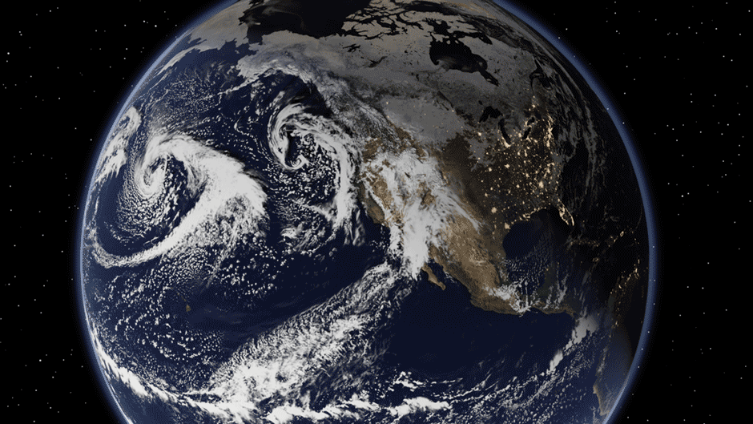

# DYAMOND3
# Cess-Potter Uniform +4K Experiments

## Synopsis
Earth system model projections of the future vary widely owing to uncertainty in radiative forcing and equilibrium climate sensitivity (ECS) – the steady-state change in temperature in response to a sustained doubling of atmospheric carbon dioxide.  Reducing uncertainty in ECS is an abiding goal of climate science, as many aspects of the global climate response to warming are tied to the overall response of global temperature. The root cause of uncertainty in ECS is uncertainty in radiative feedbacks that modulate the ability of the Earth to shed heat to space as it warms. Cloud feedback is the dominant component of this uncertainty because of the significant leverage that clouds have on the Earth’s energy budget, the wide diversity of cloud types in the atmosphere, and the fact that their radiative properties are controlled by both macroscale and microscale processes, most of which are crudely represented in global models. Given the resultant disagreement among global climate models in cloud feedback and ECS (which has persisted for decades and has recently grown), recent efforts have instead attempted to constrain climate sensitivity through synthesizing other lines of evidence (i.e., historical record, paleoclimate evidence, and process-level studies), with promising results. Nevertheless, numerical simulations of present and future climate at the global scale remain a unique and essential tool for climate science, not only for exploring and improving our understanding of Earth’s climate in a physically consistent framework, but also for providing information on future climate at space and time scales that are relevant to a growing spectrum of societal needs.  

In this context, the latest generation of high resolution (<5k km horizontal grid spacing) global storm-resolving models (GSRMs) serves as a potential game changer. This is because they explicitly simulate more small-scale processes, thereby requiring fewer subgrid-scale parameterizations than their coarse-resolution counterparts, with the anticipation that this will allow them to simulate climate more reliably. Indeed, GSRMs have been shown to simulate cloud and precipitation characteristics with much greater fidelity than coarse resolution models ([Caldwell et al 2021](https://agupubs.onlinelibrary.wiley.com/doi/full/10.1029/2021MS002544)), and explicitly simulate impactful weather events like tropical cyclones and mesoscale convective systems that cannot be resolved by coarse resolution models ([Judt et al 2021](https://www.jstage.jst.go.jp/article/jmsj/99/3/99_2021-029/_html/-char/en); [Feng et al 2018](https://agupubs.onlinelibrary.wiley.com/doi/full/10.1029/2018MS001305)). Despite these improvements, they still struggle with simulating clouds that are formed from sub-kilometer-scale motions or that depend sensitively on representation of cloud microphysics, which remain unresolved. The DYAMOND (DYnamics of the Atmospheric general circulation Modeled On Non-hydrostatic Domains) Project was established to facilitate intercomparison of GSRM representations of the atmospheric circulation at timescales of weeks to decades and to explore the ability of such models to better represent the atmospheric general circulation relative to traditional global climate models. The [first](https://www.esiwace.eu/the-project/past-phases/dyamond-initiative/services-dyamond-summer) and [second](https://www.esiwace.eu/the-project/past-phases/dyamond-initiative/services-dyamond-winter) phases of DYAMOND were successful in uniting and invigorating a growing community of global storm-resolving modelers to simulate and examine 40-day simulation campaigns in northern-hemisphere summer and winter seasons (respectively).  

The next logical step is to examine climate warming simulations with GSRMs. As part of this 3rd Phase of DYAMOND, a pair of year-long “AMIP-style” prescribed SST/SIC simulations will be conducted. The first is the control climate experiment already described in [Takasuka et al. (2024)](https://progearthplanetsci.springeropen.com/articles/10.1186/s40645-024-00668-1). The second is identical to this control experiment, except with sea surface temperatures uniformly increased by 4K everywhere. This pair of simulations will be used to explore the response of climate to warming and follow from the [Cess and Potter (1988)](https://agupubs.onlinelibrary.wiley.com/doi/abs/10.1029/JD093id07p08305) experiments that have routinely been conducted over the past several decades with coarse resolution models as an efficient way to diagnose key processes governing climate sensitivity without the need for long coupled model integrations. [Ringer et al. (2014)](https://agupubs.onlinelibrary.wiley.com/doi/abs/10.1002/2014GL060347) and [Qin et al. (2022)](https://agupubs.onlinelibrary.wiley.com/doi/10.1029/2021JD035460) have demonstrated that such idealized simulations can effectively capture the key feedback mechanisms seen in fully coupled simulations, including cloud feedbacks at global and regional scales. Moreover, [Qin et al. (2022)](https://agupubs.onlinelibrary.wiley.com/doi/10.1029/2021JD035460) find that atmosphere-only +4K experiments of short duration (e.g., only a single year) are sufficient for capturing this signal. This motivates the proposed experimental design described below.  

### The goals of these simulations are to:
* diagnose responses (including climate sensitivity, radiative feedbacks, responses of the hydrological cycle and general circulation of the atmosphere, etc.) to warming
* determine which climate responses are robust across GSRMs and which differ in important ways
* decompose and evaluate model agreement in individual climate responses
* compare and contrast the responses that emerge at storm resolving scales with those produced in traditional GCMs
* establish a baseline response to uniform warming that can be compared to subsequent experiments with non-uniform warming to explore questions related to pattern effects in high resolution models  

## Protocol
* +4K simulations should be identical to the control simulation specified in [Takasuka et al. (2024)](https://progearthplanetsci.springeropen.com/articles/10.1186/s40645-024-00668-1) in all ways except SST should be uniformly increased by 4K everywhere.
    - If a modeling group performs the simulations for a different time period, it will still be accepted even though it may complicate comparison to other models.
    - If a modeling group can only afford to run a subset of a year, it is recommended that they avoid solstice months, given that [Qin et al. (2022)](https://agupubs.onlinelibrary.wiley.com/doi/10.1029/2021JD035460) found systematically less agreement between atmosphere-only feedbacks derived from solstice months and the “true” feedbacks diagnosed in coupled simulations.
    - Use same land initial conditions as the control.
    
* Participating models must have grid spacing of 5 km or less. While it is preferred that models not incorporate a parameterized representation of atmospheric deep convection, such models will not be excluded. The vertical domain should extend to well above the troposphere (25 km or higher), and at least 75 vertical levels is desired. Models should be able to represent the actual atmospheric general circulation, which requires a full representation of fine-scale physical processes (microphysics, radiation, small-scale turbulence) as well as realistic lower boundary conditions like topography.

* Modeling centers are encouraged to implement the CFMIP Observation Simulator Package ([COSP](https://www.cfmip.org/tools-and-data/cosp)), which produces cloud fields that are more directly comparable to satellite observations and that can be used to detail cloud radiative feedbacks.
  - Highest priority output are cloud fraction histograms produced by the ISCCP simulator and cloud fraction profiles provided by the CALIPSO simulator
  - Modeling centers may choose to write the output needed to run COSP offline if online implementation is not possible.  
  
## Model output and data policy
Unlike the first two phases of DYAMOND, data archiving and access - including provision of and access to input data - will be provided through the National Energy Research Scientific Computing Center ([NERSC](https://www.nersc.gov/)). Because these Cess-Potter simulations are an order of magnitude longer than previous DYAMOND runs, and both the control and +4K runs are needed to investigate temperature-mediated changes in fields, the set of requested data must be trimmed down. Novel approaches to reducing data volume (such as coarsening output or using data compression) are welcome so long as anyone analyzing the data would be able to use the provided data.

Groups should strive to conform to the specified output (in Tables 1-2). Additional output is welcome if it is needed to understand a given model and some requested output may not be well defined for some models. Participants should document the data they provide and any relevant details for understanding or using this data. In recognition of the challenges in writing output from such large simulations, conformance to the output requirements is left up to the individual groups’ best judgment.

To address several of the primary goals listed above does not generally require high temporal or spatial resolution model output. For example, diagnosing and decomposing radiative feedbacks can be done using offline monthly-resolved radiative kernels at low spatial resolution corresponding to traditional GCMs. Given this, and the desire to facilitate collection of a large collection of model data to be hosted at a central location, we have identified high priority fields that are written at relatively low spatial (0.25 degree) resolution, keeping data volumes relatively small. These data are requested at both monthly and 3-hourly resolution (Tables 1-2), the latter to facilitate examining temperature-mediated changes in cloud organization, submonthly precipitation, convection, synoptic systems, tropical cyclones, etc. Several select 2D fields useful for storm tracking are additionally requested at 1-hourly resolution (Table 2). 

### Data Format
- The  0.25˚ horizontal resolution grid to which data should be coarsened is defined in [this scrip grid file](https://web.lcrc.anl.gov/public/e3sm/mapping/grids/cmip6_720x1440_scrip.20181001.nc).
- 3D data should be regridded to the following 37 pressure levels: 1000, 975, 950, 925, 900, 875, 850, 825, 800, 775, 750, 700, 650, 600, 550, 500, 450, 400, 350, 300, 250, 225, 200, 175, 150, 125, 100, 70, 50, 30, 20, 10, 7, 5, 3, 2, and 1 hPa.
- Data is to be provided in NetCDF files conforming to [Climate and Forecast (CF) Metadata Conventions](http://cf-pcmdi.llnl.gov/).
- For hourly and 3-hourly fields, one file per variable per day is requested.
- For monthly fields, one file per variable per month is requested.
- The axes should be named as time, level (for multi level fields), latitude, and longitude.
- The name of the variable in the NetCDF file should match the variable name provided in Tables 1 and 2.
- Filenaming convention should be: variable_frequency_experiment_model_time.nc, so precipitation from SCREAM's +4K simulation would be:
   - Hourly output: pr_hr_SCREAM_p4K_20200301.nc, pr_hr_SCREAM_p4K_20200302.nc, ...
   - 3-hourly output: pr_3hr_SCREAM_p4K_20200301.nc, pr_3hr_SCREAM_p4K_20200302.nc, ...
   - Monthly output: pr_mon_SCREAM_p4K_202003.nc, pr_mon_SCREAM_p4K_202004.nc, ...
 
### Output Variables

Table 1. 3D Output on standard pressure levels and 0.25˚ horizontal resolution.

|    | Variable | Long Name                           | Units    | Temporal Resolution |
| -- | -------- | ----------------------------------  | -------- | ------------------- |
| 1  | cl       | Cloud fraction                      | fraction | mon \|  3hr         |
| 2  | clw      | Mass fraction of cloud liquid water | kg kg−1  | mon \|  3hr         |
| 3  | cli      | Mass fraction of cloud ice water    | kg kg−1  | mon \|  3hr         |
| 4  | rainfrac | Mass fraction of rain               | kg kg−1  | mon \|  3hr         |
| 5  | grplfrac | Mass fraction of graupel            | kg kg−1  | mon \|  3hr         |
| 6  | snowfrac | Mass fraction of snow               | kg kg−1  | mon \|  3hr         |
| 7  | hur      | Relative humidity                   | fraction | mon \|  3hr         |
| 8  | hus      | Specific humidity                   | kg kg−1  | mon \|  3hr         |
| 9  | ta       | Air temperature                     | K        | mon \|  3hr         |
| 10 | ua       | Eastward wind speed                 | m s−1    | mon \|  3hr         |
| 11 | va       | Northward wind speed                | m s−1    | mon \|  3hr         |
| 12 | wa       | Upward air velocity                 | m s−1    | mon \|  3hr         |
| 13 | zg       | Geopotential height                 | m        | mon \|  3hr         |

 

Table 2. 2D output at 0.25˚ horizontal resolution.

|    | Variable | Long Name                                         | Units        | Temporal Resolution  |
| -- | -------- | ------------------------------------------------- | ------------ | -------------------- |
| 1  | clt      | Total cloud cover                                 | fraction     | mon \|  3hr          |
| 2  | clwvi    | Vertically integrated liquid + ice water          | kg m−2       | mon \|  3hr          |
| 3  | clivi    | Vertically integrated ice water                   | kg m−2       | mon \|  3hr          |
| 4  | hfls     | Surface upward latent heat flux                   | W m\-2       | mon \|  3hr          |
| 5  | hfss     | Surface upward sensible heat flux                 | W m\-2       | mon \|  3hr          |
| 6  | ts       | Surface skin temperature                          | K            | mon \|  3hr          |
| 7  | tas      | Surface (2 m) air temperature                     | K            | mon \|  3hr          |
| 8  | hurs     | Surface (2 m) relative humidity                   | fraction     | mon \|  3hr          |
| 9  | huss     | Surface (2 m) specific humidity                   | kg kg−1      | mon \|  3hr          |
| 10 | prw      | Total column water vapor                          | kg m\-2      | mon \|  3hr          |
| 11 | ps       | Surface air pressure                              | Pa           | mon \|  3hr          |
| 12 | psl      | Sea level pressure                                | Pa           | mon \|  3hr          |
| 13 | uas      | Surface (10 m) eastward wind speed                | m s\-1       | mon \|  3hr          |
| 14 | vas      | Surface (10 m) northward wind speed               | m s\-1       | mon \|  3hr          |
| 15 | sfcWind  | Surface (10 m) total wind speed                   | m s\-1       | mon \|  3hr \|  1 hr |
| 16 | uqint    | Eastward integrated vapor transport               | kg m\-1 s\-1 | mon \|  3hr \|  1 hr |
| 17 | vqint    | Northward integrated vapor transport              | kg m\-1 s\-1 | mon \|  3hr \|  1 hr |
| 18 | zg300    | 300 hPa geopotential height                       | m            | mon \|  3hr \|  1 hr |
| 19 | zg500    | 500 hPa geopotential height                       | m            | mon \|  3hr \|  1 hr |
| 20 | pr       | Surface precipitation                             | kg m\-2 s\-1 | mon \|  3hr \|  1 hr |
| 21 | rlut     | TOA upwelling longwave radiation                  | W m\-2       | mon \|  3hr \|  1 hr |
| 22 | rlutcs   | TOA upwelling clear-sky longwave radiation        | W m\-2       | mon \|  3hr          |
| 23 | rlds     | Surface downwelling longwave radiation            | W m\-2       | mon \|  3hr          |
| 24 | rldscs   | Surface downwelling clear-sky longwave radiation  | W m\-2       | mon \|  3hr          |
| 25 | rlus     | Surface upwelling longwave radiation              | W m\-2       | mon \|  3hr          |
| 26 | rsdt     | TOA downwelling shortwave radiation               | W m\-2       | mon \|  3hr          |
| 27 | rsut     | TOA upwelling shortwave radiation                 | W m\-2       | mon \|  3hr          |
| 28 | rsutcs   | TOA upwelling clear-sky shortwave radiation       | W m\-2       | mon \|  3hr          |
| 29 | rsds     | Surface downwelling shortwave radiation           | W m\-2       | mon \|  3hr          |
| 30 | rsdscs   | Surface downwelling clear-sky shortwave radiation | W m\-2       | mon \|  3hr          |
| 31 | rsus     | Surface upwelling shortwave radiation             | W m\-2       | mon \|  3hr          |
| 32 | rsuscs   | Surface upwelling clear-sky shortwave radiation   | W m\-2       | mon \|  3hr          |
| 33 | tauu     | Surface downward eastward wind stress             | N m\-2       | mon \|  3hr          |
| 34 | tauv     | Surface downward northward wind stress            | N m\-2       | mon \|  3hr          |
| 35 | wa500    | 500 hPa upward air velocity                       | m s−1        | mon \|  3hr          |

 

All output is expected to be time-averaged to the requested temporal resolution(s) noted in the tables (not snapshots). We do not request any data on native resolution. Providing COSP simulator output (especially monthly ISCCP simulator cloud fraction histograms) is strongly encouraged from the modeling groups that have implemented it in their simulations.  

### Additional Information
* Globus should be used to copy data to NERSC. See instuctions at [this location](https://docs.nersc.gov/services/globus/).
* To set up an account on NERSC to analyze the data, please contact [Mark Zelinka](mailto:zelinka1@llnl.gov) and [Paul Ullrich](mailto:ullrich4@llnl.gov).  

### Acknowledgments
This work is sponsored by the Regional and Global Model Analysis ([RGMA](https://climatemodeling.science.energy.gov/program/regional-global-model-analysis)) program of the Earth and Environmental Systems Sciences Division ([EESSD](https://science.osti.gov/ber/Research/eessd)) in the Office of Biological and Environmental Research ([BER](https://science.osti.gov/ber)) within the Department of Energy's ([DOE](https://www.energy.gov/)) Office of Science ([OS](https://science.osti.gov/)). The work at PCMDI is performed under the auspices of the U.S. Department of Energy by Lawrence Livermore National Laboratory under Contract DE-AC52-07NA27344.

    &nbsp;
    &nbsp;
    &nbsp;
    &nbsp;
    &nbsp;

###### Document version: 6 March 2025
[termsOfUse]: TermsOfUse/
