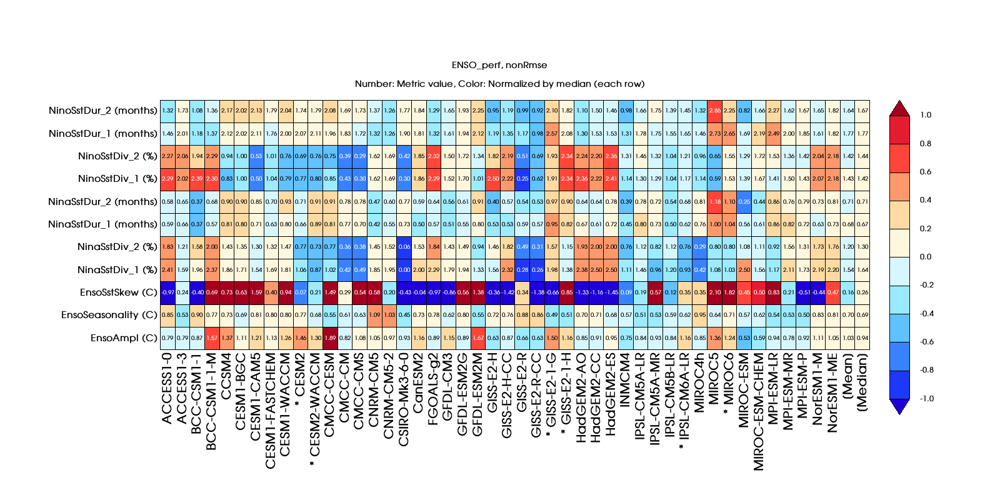

###### Research > [Metrics][Metrics] > [El Niño-Southern Oscillation (ENSO)][description_enso] > Performance
---

# El Niño-Southern Oscillation (ENSO) Performance Metrics
- [RMSE Portrait Plots](#rmse)
- [Non-RMSE Portrait Plots](#nonrmse)

---

## RMSE Portrait Plots

- Portrait plot for RMSE-based metrics of the ENSO-Performance Metrics Collection, calculated for models from CMIP5 and CMIP6(*).

---
##  Non-RMSE Portrait Plot

- Portrait plot for Non-RMSE-based metrics of the ENSO-Performance Metrics Collection, calculated for models from CMIP5 and CMIP6(*).

[Metrics]:{{site.baseurl}}/research/metrics/index.html
[description_enso]: {{site.baseurl}}/research/metrics/plot_description_enso.html
[rmse]: {{site.baseurl}}/research/metrics/enso/ENSO_perf_cmip_5and6_Rmse_PP_SidebySide_annotated.png
[nonrmse]: {{site.baseurl}}/research/metrics/enso/ENSO_perf_cmip_5and6_nonRmse_PP_SidebySide_annotated.png

