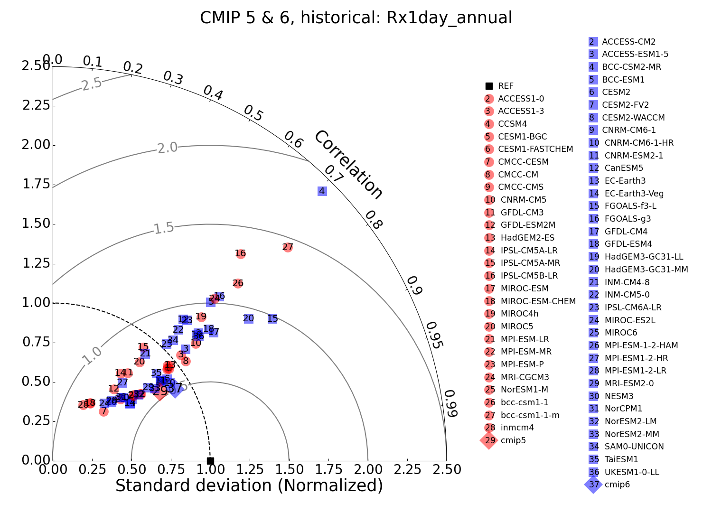
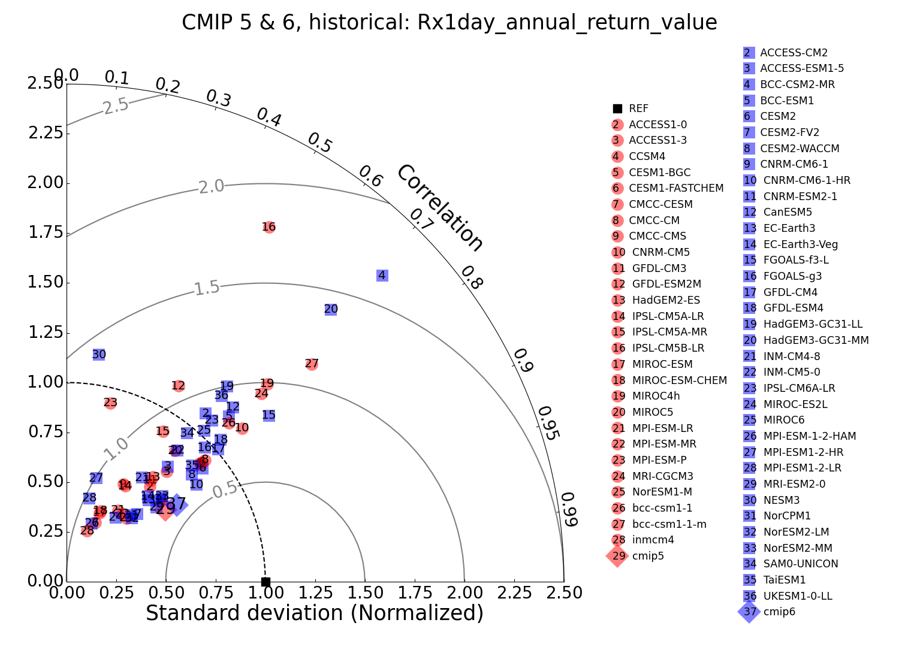

###### [Results][results] > [CMIP mean state and variability][mean_and_variability_index_page] > [Benchmarking Simulated Precipitation][precip] > Extreme
---

# Precipitation Extremes 

Using a non-stationary Generalized Extreme Value statistical method, we calculate selected extreme daily precipitation indices and their 20 year return values from the CMIP5 and CMIP6 historically forced climate models. We evaluate model performance of these indices and their return values in replicating similar quantities calculated from gridded land based daily observations. We find that at their standard resolutions, there are no meaningful differences between the two generations of models in their quality of simulated extreme daily precipitation. The evaluation results were published as [Wehner et al. (2020)](#wehner2020).

We deliberately choose the Expert Team on Climate Change Detection Indices ([ETCCDI](http://etccdi.pacificclimate.org/)) indices that are “block” extrema. “Wet days” are represented by Rx1day, the annual seasonal maxima of daily total precipitation. We evaluate the extreme variable and its return value by comparing CMIP5/6 model simulations to gridded observations on the observational products' grids. Annual maxima of daily precipitation are obtained by extraction from the [REGEN](https://hess.copernicus.org/articles/24/919/2020/) (Rainfall Estimates on a Gridded Network) gridded daily precipitation at a resolution of 1 deg x 1 deg.

Following Taylor diagrams (equivalent to Fig. 8 of [Wehner et al. 2020](#wehner2020)) are measuring model performance of simulating annual [Rx1day](#rx1day) and its [20 year return value](#return). The radial axis is normalized standard deviation while the angular axis is the centered pattern correlation. The reference data set is REGEN (black square). The concentric circles show the models’ centered RMSE. CMIP5 models are shown in red. CMIP6 models are shown in blue. Multi-model averages are denoted as “cmip5” and “cmip6” in the legend.

 

## Rx1day

“Wet days” are represented by Rx1day, the annual seasonal maxima of daily total precipitation.

## Return Value

 

---

## References

Wehner, M., P Gleckler, J Lee, 2020: Characterization of long period return values of extreme daily temperature and precipitation in the CMIP6 models: Part 1, model evaluation.  Weather and Climate Extremes, 100283, [https://doi.org/10.1016/j.wace.2020.100283](https://doi.org/10.1016/j.wace.2020.100283)

[wehner2020]: https://doi.org/10.1016/j.wace.2020.100283

[precip]:{{site.baseurl}}/results/precip
[mean_and_variability_index_page]: {{site.baseurl}}/results/physical.html
[results]:{{site.baseurl}}/results
