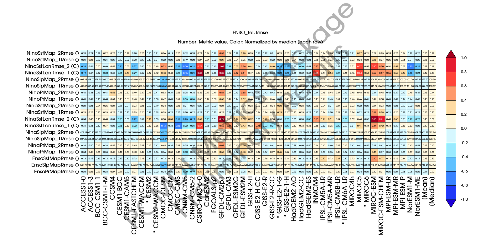
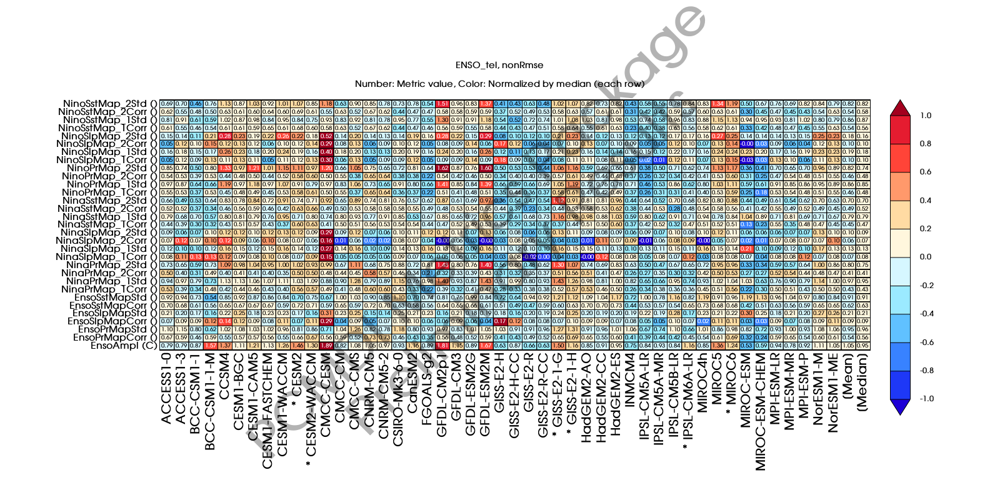

###### Research > [Metrics][Metrics] > [El Niño-Southern Oscillation (ENSO)][description_enso] > Teleconnection
---

# El Niño-Southern Oscillation (ENSO) Teleconnection Metrics
 

- [RMSE Portrait Plots](#rmse)
- [Non-RMSE Portrait Plots](#nonrmse)

 

---

## RMSE Portrait Plots

- Portrait plot for RMSE-based metrics of the ENSO-Teleconnection Metrics Collection, calculated for models from CMIP5 and CMIP6(*).

---
##  Non-RMSE Portrait Plot

- Portrait plot for Non-RMSE-based metrics of the ENSO-Teleconnection Metrics Collection, calculated for models from CMIP5 and CMIP6(*).

 

**NOTE**: These results are preliminary and the metrics used will change. The number of metrics must be reduced so we are currently investigating the link between metrics to retain only the most scientifically relevant and statistically independent metrics. The definition of ENSO events is also evolving. Interactive version coming soon.

[Metrics]:{{site.baseurl}}/research/metrics/index.html
[description_enso]: {{site.baseurl}}/research/metrics/plot_description_enso.html
[rmse]: {{site.baseurl}}/research/metrics/enso/ENSO_tel_cmip_5and6_Rmse_PP_SidebySide_annotated.png
[nonrmse]: {{site.baseurl}}/research/metrics/enso/ENSO_tel_cmip_5and6_nonRmse_PP_SidebySide_annotated.png
