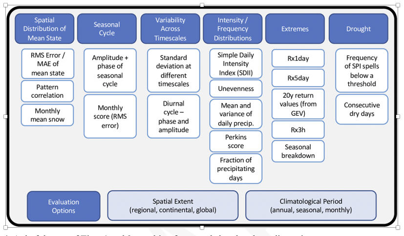

###### Research > [Metrics][Metrics] > Benchmarking Precipitation
---

# Benchmarking Precipitation

Welcome to the results site for benchmarking simulated precipitation in Earth System Models (ESMs)! This effort has been inspired by the outcomes of a July 2019 DOE workshop (Pendergrass, et al., 2019).  That workshop was motivated by discussions that have taken place in recent years in various working groups of the WCRP including the Working Group on Numerical Experimentation (WGNE) and Working Group on Coupled Models (WGCM).  This site was initially made public 2020/10/10 and will be regularly updated as our efforts advance, so check back here soon to see progress.      

 

## Spatial Distribution of Mean State

- [**Taylor diagram of spatial distribution** (CMIP6)][mean]

 

## Seasonal Cycle

- [**Line graph of domain averaged seasonal cycle with monthly mean** (CMIP6)][Line_SC-1]
- [**Bar chart of RMS and RMSC for the seasonal cycle** (CMIP6)][Bar_SC-1]  
 

## Variability Across Timescales 

(Sub-daily, Daily, Monthly, 3-Monthly, Yearly, and 3-Yearly)

### - Standard deviation at differnt timescales

- [**Bar chart of domain averaged STD across timescales** (CMIP5)][Bar_VAC-1]
- [**Bar chart of domain averaged STD across timescales** (CMIP6)][Bar_VAC-2]
- [**Portrait chart of domain averaged STD across timescales** (CMIP5)][Port_VAC-1]
- [**Portrait chart of domain averaged STD across timescales** (CMIP6)][Port_VAC-2]

### - Diurnal cycle - phase and amplitude

- [**Line graph of domain averaged diurnal cycle** (CMIP6)][Line_DC-1]
- [**Bar chart of RMS and RMSC for the diurnal cycle** (CMIP6)][Bar_DC-1]
- [**Bar chart of RMS and RMSC for the diurnal cycle** (CMIP6) (Specific sites used in Fig. 13 of Tang et al. 2020)][Bar_DC-2]  
 

## Intensity/Frequency Distribution

### - Unevenness

- [**Bar chart of domain averaged Unevenness** (CMIP5)][Bar_DC-2]  
 

## Extremes  

- [**Precipitation extreme from CMIP5/6**][extreme]
 

## Drought

Comming soon:  Frequency of SPI spells and consecutive dry days.  
 

---

## References
 

Covey, C, PJ Gleckler, C Doutriaux, DN Williams, A Dai, J Fasullo, K Trenberth, and  A Berg. 2016. ”Metrics for the diurnal cycle of precipitation: Toward routine benchmarks for climate models.”  Journal of Climate 29(12): 4461–4471,  https://doi.org/10.1175/JCLI-D-15-0664.1

Covey, C, C Doutriaux, PJ Gleckler, KE Taylor, KE Trenberth, and Y Zhang. 2018. “High-frequency intermittency in observed and model-simulated precipitation.” Geophysical Research Letters 45(22), https://doi.org/10.1029/2018GL078926

Pendergrass, A.G. and D.L. Hartmann, 2014: Two modes of change of the 
distribution of rain. Journal of Climate, 27, 8357-8371. 
doi:10.1175/JCLI-D-14-00182.1.

Pendergrass, AG, and C Deser. 2017. “Climatological characteristics of typical daily precipitation.” Journal of Climate 30(15): 5985–6003, https://doi.org/10.1175/JCLI-D-16-0684.1

Pendergrass, A. P. J. Gleckler, L. Ruby Leung, and C. Jakob, 2020: Benchmarking simulated precipitation in Earth System Models. BAMS, doi: 10.1175/BAMS-D-19-0318.1.

Perkins, SE, AJ Pitman, NJ Holbrook, and J McAneney. 2007. “Evaluation of the AR4 Climate Models' Simulated Daily Maximum Precipitation over Australia Using Probability Density Functions.” Journal of Climate 20(17): 4356–4376, https://doi.org/10.1175/JCLI4253.1

Tang, S., P. Gleckler, S. Xie, J. Lee, C. Covey, C. Zhang, and M. Ahn, 2020: Evaluating Diurnal and Semi-Diurnal Cycle of Precipitation in CMIP6 Models Using Satellite- and Ground-Based Observations. Submitted to J. Climate.

Wehner, M., P Gleckler, J Lee, 2020: Characterization of long period return values of extreme daily temperature and precipitation in the CMIP6 models: Part 1, model evaluation.  Weather and Climate Extremes, 100283, [https://doi.org/10.1016/j.wace.2020.100283](https://doi.org/10.1016/j.wace.2020.100283)

[Line_SC-1]: https://pcmdi.llnl.gov/pmp-preliminary-results/interactive_plot/precip/seasonal_cycle/pr_annual.cycle_all.loc.mod_interactive.html
[Bar_SC-1]: https://pcmdi.llnl.gov/pmp-preliminary-results/interactive_plot/precip/seasonal_cycle/pr_annual.cycle_rms.bar_all.loc.mod_interactive.html

[Bar_VAC-1]: https://pcmdi.llnl.gov/pmp-preliminary-results/interactive_plot/precip/variability_across_timescales/STD_across_timescales/pr_STD.amean_interactive_regrid.180x90_cmip5.html
[Bar_VAC-2]: https://pcmdi.llnl.gov/pmp-preliminary-results/interactive_plot/precip/variability_across_timescales/STD_across_timescales/pr_STD.amean_interactive_regrid.180x90_cmip6.html
[Port_VAC-1]: https://pcmdi.llnl.gov/pmp-preliminary-results/interactive_plot/precip/variability_across_timescales/STD_across_timescales/pr_STD.amean_portrait_interactive_regrid.180x90_cmip5.html
[Port_VAC-2]: https://pcmdi.llnl.gov/pmp-preliminary-results/interactive_plot/precip/variability_across_timescales/STD_across_timescales/pr_STD.amean_portrait_interactive_regrid.180x90_cmip6.html

[Line_DC-1]: https://pcmdi.llnl.gov/pmp-preliminary-results/interactive_plot/precip/variability_across_timescales/diurnal_cycle/pr_diurnal.cycle_all.loc.mod_interactive.html
[Bar_DC-1]: https://pcmdi.llnl.gov/pmp-preliminary-results/interactive_plot/precip/variability_across_timescales/diurnal_cycle/pr_diurnal.cycle_rms.bar_all.loc.mod_interactive.html
[Bar_DC-2]: https://pcmdi.llnl.gov/pmp-preliminary-results/interactive_plot/precip/diurnal/pr_diurnal.cycle_rms.bar_all.loc.mod_interactive.html

[Metrics]:{{site.baseurl}}/research/metrics/
[extreme]: extreme.html
[mean]: mean.html
