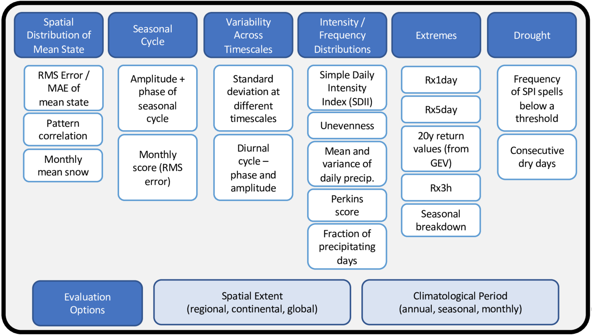

###### Research > [Metrics][Metrics] > Benchmarking Simulated Precipitation
---

# Benchmarking Simulated Precipitation
Welcome to the results site for benchmarking simulated precipitation in Earth System Models (ESMs)! This effort has been inspired by the outcomes of a July 2019 DOE workshop (Pendergrass, et al., 2019).  That workshop was motivated by discussions that have taken place in recent years in various working groups of the WCRP including the Working Group on Numerical Experimentation (WGNE) and Working Group on Coupled Models (WGCM).  This site was initially made public 2020/10/10 and will be regularly updated as our efforts advance, so check back here soon to see progress.  
 

 

## Spatial Distribution of Mean State
- [**Taylor diagrams of spatial distribution** (CMIP6-histotical)][mean]
 
 

## Seasonal Cycle
- [**Line graph of domain averaged seasonal cycle with monthly mean** (CMIP6-histotical)][Line_SC-1]
- [**Bar chart of RMS and RMSC for the seasonal cycle** (CMIP6-histotical)][Bar_SC-1]
 
 

## Variability Across Timescales (from Sub-daily to Interannual) 
The precipitation variability across timescales is measured by two independent methods: i) standard deviation at different timescales, ii) spectral power at different timescales.

### - Standard deviation at different timescales 
- [**Bar chart of domain averaged STD** (CMIP6-histotical)][Bar_VAC-2]
- [**Bar chart of domain averaged STD** (CMIP5-histotical)][Bar_VAC-1]
- [**Portrait chart of domain averaged STD** (CMIP6-histotical)][Port_VAC-2]
- [**Portrait chart of domain averaged STD** (CMIP5-histotical)][Port_VAC-1]

### - Spectral power at different timescales 
- [**Portrait chart of domain and frequency averaged spectral power** (CMIP6-histotical)][Port_PS-2]
- [**Portrait chart of domain and frequency averaged spectral power** (CMIP5-histotical)][Port_PS-1]

### - Diurnal cycle - phase and amplitude
- [**Line graph of domain averaged diurnal cycle** (CMIP6-amip)][Line_DC-1]
- [**Bar chart of RMS and RMSC for the diurnal cycle** (CMIP6-amip)][Bar_DC-1]
- [**Bar chart of RMS and RMSC for the diurnal cycle** (CMIP6-amip) (Specific ARM sites used in Fig. 10 of Tang et al. 2021)][Bar_DC-2]

### - Sub-daily intermittency
- [**Bar chart of domain averaged sub-daily intermittency** (CMIP6-amip)][Bar_SDI-1]
 
 

## Intensity/Frequency Distribution
The <a href="precip_distribution_metric_table.pdf" target="_new">precipitation distribution metrics</a> are applied to three tiers of domains below: 
 
**Domain 1 (D1)**: Large domain commonly used in the PMP (Tropics and Extratropics with separated land and ocean)
 
**Domain 2 (D2)**: Large domain clustered by precipitation (Domain 1 with separated heavy, moderate, and light precipitation regions)
 
**Domain 3 (D3)**: Modified IPCC AR6 regions (Global domain partitioned into 62 regions, [Ahn et al. 2023a](https://doi.org/10.5194/egusphere-2022-1106))
 
All plots below are **interactive portrait charts** for three tiers of domains unless otherwise stated.

| [Metric](precip_distribution_metric_table.pdf) | CMIP6-AMIP | CMIP5-AMIP
| ---- | --- | --- |
| Amount Peak | [D1][Bar_IFD-1-1], [D2][Bar_IFD-1-3], [D3][Bar_IFD-1-5] | [D1][Bar_IFD-1-2], [D2][Bar_IFD-1-4], [D3][Bar_IFD-1-6]
| Amount P10 | [D1][Bar_IFD-2-1], [D2][Bar_IFD-2-3], [D3][Bar_IFD-2-5] | [D1][Bar_IFD-2-2], [D2][Bar_IFD-2-4], [D3][Bar_IFD-2-6]
| Amount P90 | [D1][Bar_IFD-3-1], [D2][Bar_IFD-3-3], [D3][Bar_IFD-3-5] | [D1][Bar_IFD-3-2], [D2][Bar_IFD-3-4], [D3][Bar_IFD-3-6]
| Frequency Peak | [D1][Bar_IFD-4-1], [D2][Bar_IFD-4-3], [D3][Bar_IFD-4-5] | [D1][Bar_IFD-4-2], [D2][Bar_IFD-4-4], [D3][Bar_IFD-4-6]
| Frequency P10 | [D1][Bar_IFD-5-1], [D2][Bar_IFD-5-3], [D3][Bar_IFD-5-5] | [D1][Bar_IFD-5-2], [D2][Bar_IFD-5-4], [D3][Bar_IFD-5-6]
| Frequency P90 | [D1][Bar_IFD-6-1], [D2][Bar_IFD-6-3], [D3][Bar_IFD-6-5] | [D1][Bar_IFD-6-2], [D2][Bar_IFD-6-4], [D3][Bar_IFD-6-6]
| Unevenness | [D1][Bar_IFD-7-1], [D2][Bar_IFD-7-3], [D3][Bar_IFD-7-5] | [D1][Bar_IFD-7-2], [D2][Bar_IFD-7-4], [D3][Bar_IFD-7-6]
| Fraction of Precipitating Days | [D1][Bar_IFD-8-1], [D2][Bar_IFD-8-3], [D3][Bar_IFD-8-5] | [D1][Bar_IFD-8-2], [D2][Bar_IFD-8-4], [D3][Bar_IFD-8-6]
| Simple Daily Intensity Index (SDII) | [D1][Bar_IFD-9-1], [D2][Bar_IFD-9-3], [D3][Bar_IFD-9-5] | [D1][Bar_IFD-9-2], [D2][Bar_IFD-9-4], [D3][Bar_IFD-9-6]
| Perkins Score | [D1][Bar_IFD-10-1], [D2][Bar_IFD-10-3], [D3][Bar_IFD-10-5] | [D1][Bar_IFD-10-2], [D2][Bar_IFD-10-4], [D3][Bar_IFD-10-6]
| Bimodality | [D1][Bar_IFD-11-1], [D2][Bar_IFD-11-3], [D3][Bar_IFD-11-5] | [D1][Bar_IFD-11-2], [D2][Bar_IFD-11-4], [D3][Bar_IFD-11-6]
 

- [**Bar chart of large domain averaged Unevenness** (CMIP6-histotical)][Bar_IFD-7-7]
 
 

## Extremes  
- [**Precipitation extremes** (CMIP5&6-histotical)][extreme]
 
 

## Drought
Comming soon:  Frequency of SPI spells and consecutive dry days.
 

---

## References
 

Ahn, Min-Seop, Paul A. Ullrich, Jiwoo Lee, Peter J. Gleckler, Hsi-Yen Ma, Christopher R. Terai, Peter A. Bogenschutz, and Ana C. Ordonez, 2023b: Bimodality in Simulated Precipitation Frequency Distributions and Its Relationship with Convective Parameterizations, Geophysical Research Letters, under review.

Ahn, Min-Seop, Paul A. Ullrich, Peter J. Gleckler, Jiwoo Lee, Ana C. Ordonez, and Angeline G. Pendergrass, 2023a: Evaluating Precipitation Distributions at Regional Scales: A Benchmarking Framework and Application to CMIP5 and CMIP6, Geoscientific Model Development, under review, [https://doi.org/10.5194/egusphere-2022-1106](https://doi.org/10.5194/egusphere-2022-1106)

Ahn, Min-Seop, Peter J. Gleckler, Jiwoo Lee, Angeline G. Pendergrass, and Christian Jakob, 2022: Benchmarking Simulated Precipitation Variability Amplitude across Timescales, Jornal of Climate, 35, 3173–3196, [https://doi.org/10.1175/JCLI-D-21-0542.1](https://doi.org/10.1175/JCLI-D-21-0542.1)

Covey, C, PJ Gleckler, C Doutriaux, DN Williams, A Dai, J Fasullo, K Trenberth, and  A Berg. 2016: Metrics for the diurnal cycle of precipitation: Toward routine benchmarks for climate models.  Journal of Climate 29(12): 4461–4471, [https://doi.org/10.1175/JCLI-D-15-0664.1](https://doi.org/10.1175/JCLI-D-15-0664.1)

Covey, C, C Doutriaux, PJ Gleckler, KE Taylor, KE Trenberth, and Y Zhang. 2018: High-frequency intermittency in observed and model-simulated precipitation. Geophysical Research Letters 45(22), [https://doi.org/10.1029/2018GL078926](https://doi.org/10.1029/2018GL078926)

Pendergrass, A.G. and D.L. Hartmann, 2014: Two modes of change of the distribution of rain. Journal of Climate, 27, 8357-8371. [https://doi.org/10.1175/JCLI-D-14-00182.1](https://doi.org/10.1175/JCLI-D-14-00182.1)

Pendergrass, AG, and C Deser. 2017: Climatological characteristics of typical daily precipitation. Journal of Climate 30(15): 5985–6003, [https://doi.org/10.1175/JCLI-D-16-0684.1](https://doi.org/10.1175/JCLI-D-16-0684.1)

Pendergrass, A. P. J. Gleckler, L. Ruby Leung, and C. Jakob, 2020: Benchmarking simulated precipitation in Earth System Models. BAMS, [https://doi.org/10.1175/BAMS-D-19-0318.1](https://doi.org/10.1175/BAMS-D-19-0318.1)

Perkins, SE, AJ Pitman, NJ Holbrook, and J McAneney. 2007: Evaluation of the AR4 Climate Models' Simulated Daily Maximum Precipitation over Australia Using Probability Density Functions. Journal of Climate 20(17): 4356–4376, [https://doi.org/10.1175/JCLI4253.1](https://doi.org/10.1175/JCLI4253.1)

Tang, S., P. Gleckler, S. Xie, J. Lee, M.-S. Ahn, C. Covey, and C. Zhang, 2021: Evaluating Diurnal and Semi-Diurnal Cycle of Precipitation in CMIP6 Models Using Satellite- and Ground-Based Observations. J. Clim., 1–56, [https://doi.org/10.1175/JCLI-D-20-0639.1](https://doi.org/10.1175/JCLI-D-20-0639.1)

Trenberth, K. E., Zhang, Y., & Gehne, M. (2017). Intermittency in precipitation: Duration, frequency, intensity, and amounts using hourly data. Journal of Hydrometeorology, 18(5), 1393–1412. [https://doi.org/10.1175/JHM-D-16-0263.1](https://doi.org/10.1175/JHM-D-16-0263.1)

Wehner, M., P Gleckler, J Lee, 2020: Characterization of long period return values of extreme daily temperature and precipitation in the CMIP6 models: Part 1, model evaluation.  Weather and Climate Extremes, 100283, [https://doi.org/10.1016/j.wace.2020.100283](https://doi.org/10.1016/j.wace.2020.100283)

[Line_SC-1]: https://pcmdi.llnl.gov/pmp-preliminary-results/interactive_plot/precip/seasonal_cycle/pr_annual.cycle_all.loc.mod_interactive.html
[Bar_SC-1]: https://pcmdi.llnl.gov/pmp-preliminary-results/interactive_plot/precip/seasonal_cycle/pr_annual.cycle_rms.bar_all.loc.mod_interactive.html

[Bar_VAC-1]: https://pcmdi.llnl.gov/pmp-preliminary-results/interactive_plot/precip/variability_across_timescales/STD_across_timescales/pr_STD.amean_interactive_regrid.180x90_cmip5.html
[Bar_VAC-2]: https://pcmdi.llnl.gov/pmp-preliminary-results/interactive_plot/precip/variability_across_timescales/STD_across_timescales/pr_STD.amean_interactive_regrid.180x90_cmip6.html
[Port_VAC-1]: https://pcmdi.llnl.gov/pmp-preliminary-results/interactive_plot/precip/variability_across_timescales/STD_across_timescales/pr_STD.amean_portrait_interactive_regrid.180x90_cmip5.html
[Port_VAC-2]: https://pcmdi.llnl.gov/pmp-preliminary-results/interactive_plot/precip/variability_across_timescales/STD_across_timescales/pr_STD.amean_portrait_interactive_regrid.180x90_cmip6.html

[Port_PS-1]: https://pcmdi.llnl.gov/pmp-preliminary-results/interactive_plot/precip/variability_across_timescales/PS_across_timescales/portrait_PS_pr.3hr_ratio_regrid.180x90_cmip5_ensmean_obsmean_woSD_interactive.html
[Port_PS-2]: https://pcmdi.llnl.gov/pmp-preliminary-results/interactive_plot/precip/variability_across_timescales/PS_across_timescales/portrait_PS_pr.3hr_ratio_regrid.180x90_cmip6_ensmean_obsmean_woSD_interactive.html

[Line_DC-1]: https://pcmdi.llnl.gov/pmp-preliminary-results/interactive_plot/precip/variability_across_timescales/diurnal_cycle/pr_diurnal.cycle_all.loc.mod_interactive.html
[Bar_DC-1]: https://pcmdi.llnl.gov/pmp-preliminary-results/interactive_plot/precip/variability_across_timescales/diurnal_cycle/pr_diurnal.cycle_rms.bar_all.loc.mod_interactive.html
[Bar_DC-2]: https://pcmdi.llnl.gov/pmp-preliminary-results/interactive_plot/precip/diurnal/pr_diurnal.cycle_rms.bar_all.loc.mod_interactive.html

[Bar_SDI-1]: https://pcmdi.llnl.gov/pmp-preliminary-results/interactive_plot/precip/variability_across_timescales/intermittency/pr_intermittency.amean_interactive.html

[Bar_IFD-1-1]: https://pcmdi.llnl.gov/pmp-preliminary-results/interactive_plot/precip/intensity.frequency_distribution/large_domain/interactive_portrait_dits_regrid.180x90_ensmean_cmip6_amtpeak_ANN.html
[Bar_IFD-1-2]: https://pcmdi.llnl.gov/pmp-preliminary-results/interactive_plot/precip/intensity.frequency_distribution/large_domain/interactive_portrait_dits_regrid.180x90_ensmean_cmip5_amtpeak_ANN.html
[Bar_IFD-1-3]: https://pcmdi.llnl.gov/pmp-preliminary-results/interactive_plot/precip/intensity.frequency_distribution/large.clust_domain/interactive_portrait_dits_regrid.180x90_ensmean_cmip6_amtpeak_ANN.html
[Bar_IFD-1-4]: https://pcmdi.llnl.gov/pmp-preliminary-results/interactive_plot/precip/intensity.frequency_distribution/large.clust_domain/interactive_portrait_dits_regrid.180x90_ensmean_cmip5_amtpeak_ANN.html
[Bar_IFD-1-5]: https://pcmdi.llnl.gov/pmp-preliminary-results/interactive_plot/precip/intensity.frequency_distribution/AR6.modified_domain/interactive_portrait_dits_regrid.180x90_ensmean_cmip6_amtpeak_ANN.html
[Bar_IFD-1-6]: https://pcmdi.llnl.gov/pmp-preliminary-results/interactive_plot/precip/intensity.frequency_distribution/AR6.modified_domain/interactive_portrait_dits_regrid.180x90_ensmean_cmip5_amtpeak_ANN.html

[Bar_IFD-2-1]: https://pcmdi.llnl.gov/pmp-preliminary-results/interactive_plot/precip/intensity.frequency_distribution/large_domain/interactive_portrait_dits_regrid.180x90_ensmean_cmip6_amtP10_ANN.html
[Bar_IFD-2-2]: https://pcmdi.llnl.gov/pmp-preliminary-results/interactive_plot/precip/intensity.frequency_distribution/large_domain/interactive_portrait_dits_regrid.180x90_ensmean_cmip5_amtP10_ANN.html
[Bar_IFD-2-3]: https://pcmdi.llnl.gov/pmp-preliminary-results/interactive_plot/precip/intensity.frequency_distribution/large.clust_domain/interactive_portrait_dits_regrid.180x90_ensmean_cmip6_amtP10_ANN.html
[Bar_IFD-2-4]: https://pcmdi.llnl.gov/pmp-preliminary-results/interactive_plot/precip/intensity.frequency_distribution/large.clust_domain/interactive_portrait_dits_regrid.180x90_ensmean_cmip5_amtP10_ANN.html
[Bar_IFD-2-5]: https://pcmdi.llnl.gov/pmp-preliminary-results/interactive_plot/precip/intensity.frequency_distribution/AR6.modified_domain/interactive_portrait_dits_regrid.180x90_ensmean_cmip6_amtP10_ANN.html
[Bar_IFD-2-6]: https://pcmdi.llnl.gov/pmp-preliminary-results/interactive_plot/precip/intensity.frequency_distribution/AR6.modified_domain/interactive_portrait_dits_regrid.180x90_ensmean_cmip5_amtP10_ANN.html

[Bar_IFD-3-1]: https://pcmdi.llnl.gov/pmp-preliminary-results/interactive_plot/precip/intensity.frequency_distribution/large_domain/interactive_portrait_dits_regrid.180x90_ensmean_cmip6_amtP90_ANN.html
[Bar_IFD-3-2]: https://pcmdi.llnl.gov/pmp-preliminary-results/interactive_plot/precip/intensity.frequency_distribution/large_domain/interactive_portrait_dits_regrid.180x90_ensmean_cmip5_amtP90_ANN.html
[Bar_IFD-3-3]: https://pcmdi.llnl.gov/pmp-preliminary-results/interactive_plot/precip/intensity.frequency_distribution/large.clust_domain/interactive_portrait_dits_regrid.180x90_ensmean_cmip6_amtP90_ANN.html
[Bar_IFD-3-4]: https://pcmdi.llnl.gov/pmp-preliminary-results/interactive_plot/precip/intensity.frequency_distribution/large.clust_domain/interactive_portrait_dits_regrid.180x90_ensmean_cmip5_amtP90_ANN.html
[Bar_IFD-3-5]: https://pcmdi.llnl.gov/pmp-preliminary-results/interactive_plot/precip/intensity.frequency_distribution/AR6.modified_domain/interactive_portrait_dits_regrid.180x90_ensmean_cmip6_amtP90_ANN.html
[Bar_IFD-3-6]: https://pcmdi.llnl.gov/pmp-preliminary-results/interactive_plot/precip/intensity.frequency_distribution/AR6.modified_domain/interactive_portrait_dits_regrid.180x90_ensmean_cmip5_amtP90_ANN.html

[Bar_IFD-4-1]: https://pcmdi.llnl.gov/pmp-preliminary-results/interactive_plot/precip/intensity.frequency_distribution/large_domain/interactive_portrait_dits_regrid.180x90_ensmean_cmip6_frqpeak_ANN.html
[Bar_IFD-4-2]: https://pcmdi.llnl.gov/pmp-preliminary-results/interactive_plot/precip/intensity.frequency_distribution/large_domain/interactive_portrait_dits_regrid.180x90_ensmean_cmip5_frqpeak_ANN.html
[Bar_IFD-4-3]: https://pcmdi.llnl.gov/pmp-preliminary-results/interactive_plot/precip/intensity.frequency_distribution/large.clust_domain/interactive_portrait_dits_regrid.180x90_ensmean_cmip6_frqpeak_ANN.html
[Bar_IFD-4-4]: https://pcmdi.llnl.gov/pmp-preliminary-results/interactive_plot/precip/intensity.frequency_distribution/large.clust_domain/interactive_portrait_dits_regrid.180x90_ensmean_cmip5_frqpeak_ANN.html
[Bar_IFD-4-5]: https://pcmdi.llnl.gov/pmp-preliminary-results/interactive_plot/precip/intensity.frequency_distribution/AR6.modified_domain/interactive_portrait_dits_regrid.180x90_ensmean_cmip6_frqpeak_ANN.html
[Bar_IFD-4-6]: https://pcmdi.llnl.gov/pmp-preliminary-results/interactive_plot/precip/intensity.frequency_distribution/AR6.modified_domain/interactive_portrait_dits_regrid.180x90_ensmean_cmip5_frqpeak_ANN.html

[Bar_IFD-5-1]: https://pcmdi.llnl.gov/pmp-preliminary-results/interactive_plot/precip/intensity.frequency_distribution/large_domain/interactive_portrait_dits_regrid.180x90_ensmean_cmip6_frqP10_ANN.html
[Bar_IFD-5-2]: https://pcmdi.llnl.gov/pmp-preliminary-results/interactive_plot/precip/intensity.frequency_distribution/large_domain/interactive_portrait_dits_regrid.180x90_ensmean_cmip5_frqP10_ANN.html
[Bar_IFD-5-3]: https://pcmdi.llnl.gov/pmp-preliminary-results/interactive_plot/precip/intensity.frequency_distribution/large.clust_domain/interactive_portrait_dits_regrid.180x90_ensmean_cmip6_frqP10_ANN.html
[Bar_IFD-5-4]: https://pcmdi.llnl.gov/pmp-preliminary-results/interactive_plot/precip/intensity.frequency_distribution/large.clust_domain/interactive_portrait_dits_regrid.180x90_ensmean_cmip5_frqP10_ANN.html
[Bar_IFD-5-5]: https://pcmdi.llnl.gov/pmp-preliminary-results/interactive_plot/precip/intensity.frequency_distribution/AR6.modified_domain/interactive_portrait_dits_regrid.180x90_ensmean_cmip6_frqP10_ANN.html
[Bar_IFD-5-6]: https://pcmdi.llnl.gov/pmp-preliminary-results/interactive_plot/precip/intensity.frequency_distribution/AR6.modified_domain/interactive_portrait_dits_regrid.180x90_ensmean_cmip5_frqP10_ANN.html

[Bar_IFD-6-1]: https://pcmdi.llnl.gov/pmp-preliminary-results/interactive_plot/precip/intensity.frequency_distribution/large_domain/interactive_portrait_dits_regrid.180x90_ensmean_cmip6_frqP90_ANN.html
[Bar_IFD-6-2]: https://pcmdi.llnl.gov/pmp-preliminary-results/interactive_plot/precip/intensity.frequency_distribution/large_domain/interactive_portrait_dits_regrid.180x90_ensmean_cmip5_frqP90_ANN.html
[Bar_IFD-6-3]: https://pcmdi.llnl.gov/pmp-preliminary-results/interactive_plot/precip/intensity.frequency_distribution/large.clust_domain/interactive_portrait_dits_regrid.180x90_ensmean_cmip6_frqP90_ANN.html
[Bar_IFD-6-4]: https://pcmdi.llnl.gov/pmp-preliminary-results/interactive_plot/precip/intensity.frequency_distribution/large.clust_domain/interactive_portrait_dits_regrid.180x90_ensmean_cmip5_frqP90_ANN.html
[Bar_IFD-6-5]: https://pcmdi.llnl.gov/pmp-preliminary-results/interactive_plot/precip/intensity.frequency_distribution/AR6.modified_domain/interactive_portrait_dits_regrid.180x90_ensmean_cmip6_frqP90_ANN.html
[Bar_IFD-6-6]: https://pcmdi.llnl.gov/pmp-preliminary-results/interactive_plot/precip/intensity.frequency_distribution/AR6.modified_domain/interactive_portrait_dits_regrid.180x90_ensmean_cmip5_frqP90_ANN.html

[Bar_IFD-7-1]: https://pcmdi.llnl.gov/pmp-preliminary-results/interactive_plot/precip/intensity.frequency_distribution/large_domain/interactive_portrait_dits_regrid.180x90_ensmean_cmip6_unevenness_ANN.html
[Bar_IFD-7-2]: https://pcmdi.llnl.gov/pmp-preliminary-results/interactive_plot/precip/intensity.frequency_distribution/large_domain/interactive_portrait_dits_regrid.180x90_ensmean_cmip5_unevenness_ANN.html
[Bar_IFD-7-3]: https://pcmdi.llnl.gov/pmp-preliminary-results/interactive_plot/precip/intensity.frequency_distribution/large.clust_domain/interactive_portrait_dits_regrid.180x90_ensmean_cmip6_unevenness_ANN.html
[Bar_IFD-7-4]: https://pcmdi.llnl.gov/pmp-preliminary-results/interactive_plot/precip/intensity.frequency_distribution/large.clust_domain/interactive_portrait_dits_regrid.180x90_ensmean_cmip5_unevenness_ANN.html
[Bar_IFD-7-5]: https://pcmdi.llnl.gov/pmp-preliminary-results/interactive_plot/precip/intensity.frequency_distribution/AR6.modified_domain/interactive_portrait_dits_regrid.180x90_ensmean_cmip6_unevenness_ANN.html
[Bar_IFD-7-6]: https://pcmdi.llnl.gov/pmp-preliminary-results/interactive_plot/precip/intensity.frequency_distribution/AR6.modified_domain/interactive_portrait_dits_regrid.180x90_ensmean_cmip5_unevenness_ANN.html
[Bar_IFD-7-7]: https://pcmdi.llnl.gov/pmp-preliminary-results/interactive_plot/precip/intensity.frequency_distribution/unevenness/pr_unevenness.amean_interactive.html

[Bar_IFD-8-1]: https://pcmdi.llnl.gov/pmp-preliminary-results/interactive_plot/precip/intensity.frequency_distribution/large_domain/interactive_portrait_dits_regrid.180x90_ensmean_cmip6_prdyfrac_ANN.html
[Bar_IFD-8-2]: https://pcmdi.llnl.gov/pmp-preliminary-results/interactive_plot/precip/intensity.frequency_distribution/large_domain/interactive_portrait_dits_regrid.180x90_ensmean_cmip5_prdyfrac_ANN.html
[Bar_IFD-8-3]: https://pcmdi.llnl.gov/pmp-preliminary-results/interactive_plot/precip/intensity.frequency_distribution/large.clust_domain/interactive_portrait_dits_regrid.180x90_ensmean_cmip6_prdyfrac_ANN.html
[Bar_IFD-8-4]: https://pcmdi.llnl.gov/pmp-preliminary-results/interactive_plot/precip/intensity.frequency_distribution/large.clust_domain/interactive_portrait_dits_regrid.180x90_ensmean_cmip5_prdyfrac_ANN.html
[Bar_IFD-8-5]: https://pcmdi.llnl.gov/pmp-preliminary-results/interactive_plot/precip/intensity.frequency_distribution/AR6.modified_domain/interactive_portrait_dits_regrid.180x90_ensmean_cmip6_prdyfrac_ANN.html
[Bar_IFD-8-6]: https://pcmdi.llnl.gov/pmp-preliminary-results/interactive_plot/precip/intensity.frequency_distribution/AR6.modified_domain/interactive_portrait_dits_regrid.180x90_ensmean_cmip5_prdyfrac_ANN.html

[Bar_IFD-9-1]: https://pcmdi.llnl.gov/pmp-preliminary-results/interactive_plot/precip/intensity.frequency_distribution/large_domain/interactive_portrait_dits_regrid.180x90_ensmean_cmip6_sdii_ANN.html
[Bar_IFD-9-2]: https://pcmdi.llnl.gov/pmp-preliminary-results/interactive_plot/precip/intensity.frequency_distribution/large_domain/interactive_portrait_dits_regrid.180x90_ensmean_cmip5_sdii_ANN.html
[Bar_IFD-9-3]: https://pcmdi.llnl.gov/pmp-preliminary-results/interactive_plot/precip/intensity.frequency_distribution/large.clust_domain/interactive_portrait_dits_regrid.180x90_ensmean_cmip6_sdii_ANN.html
[Bar_IFD-9-4]: https://pcmdi.llnl.gov/pmp-preliminary-results/interactive_plot/precip/intensity.frequency_distribution/large.clust_domain/interactive_portrait_dits_regrid.180x90_ensmean_cmip5_sdii_ANN.html
[Bar_IFD-9-5]: https://pcmdi.llnl.gov/pmp-preliminary-results/interactive_plot/precip/intensity.frequency_distribution/AR6.modified_domain/interactive_portrait_dits_regrid.180x90_ensmean_cmip6_sdii_ANN.html
[Bar_IFD-9-6]: https://pcmdi.llnl.gov/pmp-preliminary-results/interactive_plot/precip/intensity.frequency_distribution/AR6.modified_domain/interactive_portrait_dits_regrid.180x90_ensmean_cmip5_sdii_ANN.html

[Bar_IFD-10-1]: https://pcmdi.llnl.gov/pmp-preliminary-results/interactive_plot/precip/intensity.frequency_distribution/large_domain/interactive_portrait_dits_regrid.180x90_ensmean_cmip6_pscore_ANN.html
[Bar_IFD-10-2]: https://pcmdi.llnl.gov/pmp-preliminary-results/interactive_plot/precip/intensity.frequency_distribution/large_domain/interactive_portrait_dits_regrid.180x90_ensmean_cmip5_pscore_ANN.html
[Bar_IFD-10-3]: https://pcmdi.llnl.gov/pmp-preliminary-results/interactive_plot/precip/intensity.frequency_distribution/large.clust_domain/interactive_portrait_dits_regrid.180x90_ensmean_cmip6_pscore_ANN.html
[Bar_IFD-10-4]: https://pcmdi.llnl.gov/pmp-preliminary-results/interactive_plot/precip/intensity.frequency_distribution/large.clust_domain/interactive_portrait_dits_regrid.180x90_ensmean_cmip5_pscore_ANN.html
[Bar_IFD-10-5]: https://pcmdi.llnl.gov/pmp-preliminary-results/interactive_plot/precip/intensity.frequency_distribution/AR6.modified_domain/interactive_portrait_dits_regrid.180x90_ensmean_cmip6_pscore_ANN.html
[Bar_IFD-10-6]: https://pcmdi.llnl.gov/pmp-preliminary-results/interactive_plot/precip/intensity.frequency_distribution/AR6.modified_domain/interactive_portrait_dits_regrid.180x90_ensmean_cmip5_pscore_ANN.html

[Bar_IFD-11-1]: https://pcmdi.llnl.gov/pmp-preliminary-results/interactive_plot/precip/intensity.frequency_distribution/large_domain/interactive_portrait_dits_regrid.180x90_ensmean_cmip6_bimod_ANN.html
[Bar_IFD-11-2]: https://pcmdi.llnl.gov/pmp-preliminary-results/interactive_plot/precip/intensity.frequency_distribution/large_domain/interactive_portrait_dits_regrid.180x90_ensmean_cmip5_bimod_ANN.html
[Bar_IFD-11-3]: https://pcmdi.llnl.gov/pmp-preliminary-results/interactive_plot/precip/intensity.frequency_distribution/large.clust_domain/interactive_portrait_dits_regrid.180x90_ensmean_cmip6_bimod_ANN.html
[Bar_IFD-11-4]: https://pcmdi.llnl.gov/pmp-preliminary-results/interactive_plot/precip/intensity.frequency_distribution/large.clust_domain/interactive_portrait_dits_regrid.180x90_ensmean_cmip5_bimod_ANN.html
[Bar_IFD-11-5]: https://pcmdi.llnl.gov/pmp-preliminary-results/interactive_plot/precip/intensity.frequency_distribution/AR6.modified_domain/interactive_portrait_dits_regrid.180x90_ensmean_cmip6_bimod_ANN.html
[Bar_IFD-11-6]: https://pcmdi.llnl.gov/pmp-preliminary-results/interactive_plot/precip/intensity.frequency_distribution/AR6.modified_domain/interactive_portrait_dits_regrid.180x90_ensmean_cmip5_bimod_ANN.html

[Metrics]:{{site.baseurl}}/research/metrics/
[extreme]: extreme.md
[mean]: mean.md
