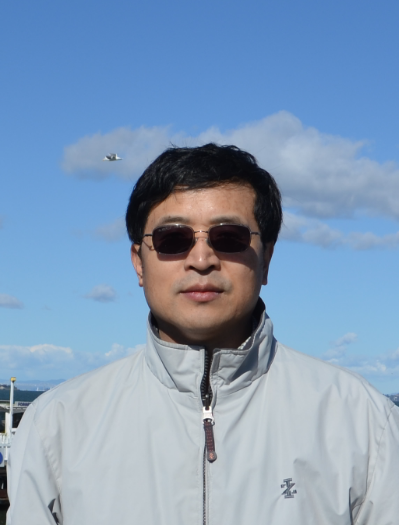

 
    
    <h1>Dr. Shaocheng Xie </h1>
    <h2>Research Scientist, Section Head</h2>
    <h2>Climate Science Section</h2>

    Lawrence Livermore National Laboratory 
    7000 East Avenue, L-103 
    Livermore, CA 94551 
     
    Tel:  
    Fax:  
    Email: <a href="mailto:xie2@llnl.gov">xie2@llnl.gov</a> 

## Education

Ph.D., 1998, State University of New York at Stony Brook. New York, USA.

M.S., 1988, Chinese Academy of Meteorological Sciences. Beijing, China.

B.S., 1985, Nanjing Institute of Meteorology, Nanjing, China.

## Professional Employment

***Jun 2001- Present: Research Scientist, Lawrence Livermore National Laboratory (LLNL), Livermore, CA.***

*   Section Head for Climate Science Section, (2022 - )

*   Group leader for the Cloud Processes Research and Modeling group (2013 - 2022)

*   LLNL Climate Program Leadership Team Member (2013 - )   

*   Deputy group leader for Climate and Carbon Science group (2010 – 2013)

***Oct 1998 - May 2001: Post-doctoral researcher, Lawrence Livermore National Laboratory, Livermore, CA.***

***Aug 1993 - Oct 1998: Research Assistant, Inst. of Terrestrial and Planetary Atmosphere, SUNY at Stony Brook. Stony Brook, New York.***

***Jul 1988 - Aug. 1993: Research scientist/Senior Research Scientist, Numerical Weather Prediction Division, National Meteorological Center, Beijing, China.***

*   Technical Leader for developing the second generation of the Chinese medium-range weather forecast model

## Professional Experience

My research interests include climate model development and validation, cloud and convection parameterization developments, and objective data analysis. I work with the DOE Energy Exascale Earth System Model (E3SM) and the NSF/DOE Community Atmospheric Model (CAM). I use a hierarchy process modeling approach, including single-column model (SCM), cloud-resolving model (CRM), and the short-range hindcast approach (e.g., Cloud-Associated Parameterizations Testbed (CAPT)), to test existing and new parameterizations with both field data and satellite observations.

As a lead for the E3SM Atmospheric Group, I led/co-led the development of the first generation of E3SM Atmosphere Model (EAMv1) and its the next generation development of atmospheric physics for EAMv3. I am currently leading the development of EAMv3 with the specific emphasis on integrating and assessing various improvements in atmospheric chemistry, aerosol, clouds, and convection in E3SM.

My research on parameterization developments is mainly focused on convective trigger/closure for deep convection. Specifically, I would like to understand what physical processes and large-scale dynamic and thermodynamic control of cumulus convection and how these processes can be appropriately parameterized in climate models. Currently I emphasize on improving the diurnal cycle of model precipitation, particularly the nocturnal elevated  convection over lands, through improving convective triggering mechanisms. I am leading a Global Atmospheric System Studies (GASS) project on modeling diurnal and semi-diurnal cycle of precipitation in different climate regimes.

For the field data analysis, the goal is to develop necessary data products with advanced data analysis methods and quantify their uncertainty in support of cloud modeling study and climate model development. I have been heavily involved in the DOE Atmospheric Radiation Measurement (ARM) program since 1998. One of my responsibilities is to transform the detailed ARM observations into a form that can be easily used by the climate modeling community. Some widely used data products from my ARM science infrastructure group include the ARM best estimate dataset (ARMBE) and the variational analysis derived large-scale forcing data for SCM/CRM/LES studies. We also develop tools to promote ARM data particularly to the climate modeling community, which includes the ongoing effort to develop an ARM radar simulator and an ARM-oriented process diagnostics package for GCMs. 

In recent years, I have started to explore the machine learning approach to help climate model developments and address data quality issues with ARM observations.

Before I came to the United States, I had worked for 5 years at the National Meteorological Center of China. My research was in the development of numerical weather forecast model for medium-range weather forecasts, which included the development of numerical methods for calculating large-scale advection terms and testing various parameterizations of cumulus convection. I was the major project leader for the development of the second generation of the Chinese Medium-range Weather Forecast Model.

## Leadership in Major US DOE Climate Projects

***Climate Modeling and Evaluation*** 

*   Council Member of the US DOE Energy Exascale Earth System Model (E3SM) (2018 - )

*   Leader for E3SM Phase 3 Atmosphere Group (2022 - )

*   Leader for E3SM Next Generation Development (NGD) - Atmospheric Physics (2018 - 2022)

*   Co-Lead of the E3SM Atmospheric Group for developing the first generation of E3SM Atmosphere Model (EAMv1) (2015 - 2018)

*   Co-Lead of the DOE multi-lab & institution Climate Model Development and Validation (CMDV) - RRM project (2016 - 2019)

*   Co-PI for the DOE Cloud-Associated Parameterizations Testbed (CAPT) project at LLNL, which use the weather forecast technique to diagnose and understand climate model errors (2010 –2015)

***Atmospheric Radiation Measurement (ARM) and Atmospheric System Research (ASR)***

*   Leader for the DOE ARM data infrastructure project at LLNL for modeling data support (2008 – )

*   Modeling Lead of the DOE ARM Architecture and Services Strategy Team (ASST) (2012 – )

*   Member of the DOE ARM-ASR Coordination Team (AACT), a constituent group that includes members from both ARM and ASR leadership (2019 – 2021)

*   Lead ARM Translator (liaisons between the scientific community and ARM infrastructure staff members) (2019 – 2021) 

*   Leader for the DOE ARM Machine Learning Project at LLNL (2018 - 2019)

## Research Highlights

* Led/Co-Led the development of the DOE E3SM atmosphere model version 1 (2018) and the next generation development of atmospheric physics for E3SM version 3 (2022)

* Major developer/played leading role in developing the second generation of Chinese medium-range weather forecast model (1993). The work received the first place award of the Chinese Meteorological Administration (CMA) Science and Technology Award in 1994, the most prestigious award in CMA.

* The convective triggering mechanism developed in Xie et al. (2019) has been used in E3SM version 2 for improving its precipitation distribution and diurnal cycle. The work is highlighted by eos: https://eos.org/research-spotlights/one-step-closer-to-a-milestone-in-climate-modeling

* The new convective triggering mechanism developed in Xie and Zhang (2000) has been used in the operational weather prediction model of the Japanese Meteorological Agency (JMA) to improve its precipitation forecast in 2008. Relevant studies were highlighted in both “Our Changing Planet - The U.S. Climate Change Science Program for Fiscal Year 2006” and the “DOE ARM Notable Research Findings for the Past Five Years”.

* Project leader for the ARM Best Estimate data, the large-scale forcing data, and ARM process-oriented diagnostic package and ARM cloud radar simulator for climate model evaluation and development.

* Cloud-Associated Parameterizations Testbed (co-Lead)

* The research on developing continuous large-scale forcing datasets for SCMs/CRMs was highlighted in the “DOE ARM Notable Research Finds for the Past Five Years”.

* The ARM Best Estimate (ARMBE) dataset was highlighted by the 2010 DOE BER Advisory Committee (BERAC) review for the ARM program. The idea of creating ARMBE-like dataset is being adopted by several field programs in US and Europe.

* Built an SCM based on the NCAR CCM3.

## Awards (selected)

* DOE Energy Exascale Earth System Model (E3SM) Award for “Leadership and dedication to the Phase E3SM project as Phase 1 Atmosphere Group Leaders”, DOE, 2018.

* Physical and Life Sciences Directorate Award for “Leadership and dedication to the DOE E3SM version 1 development”, LLNL, 2019

* LLNL Deputy Director for Science and Technology Excellence in Publication Awards "The role of surface energy budget errors to the warm surface air temperature error over the central United States". LLNL, September 2019.

* Physical and Life Sciences Directorate Award for Excellence in Publication “For improving our ability to model one of climate’s most challenging aspects: precipitation”, LLNL, 2020.

* Physical and Life Sciences Directorate Award for Excellence in Publication “For improving our understanding of the role of clouds, radiation, and precipitation processes in contributing to surface temperature biases”, LLNL, 2018.

* Physical and Life Sciences Directorate Mentor Award for “Outstanding Mentorship of Postdoctoral Staff”, Lawrence Livermore National Laboratory, 2016.

* Energy and Environment Directorate Program Award for “developing a new convective triggering function for NCAR CAM2 to improve the predicted precipitation over land”, Lawrence Livermore National Laboratory, 2004.

* Chinese Meteorological Administration (CMA) Science and Technology Award (1st place) for “developing the second generation of Chinese medium-range weather forecast model”, CMA, China, 1994. This is a team award.

* Beijing Meteorological Society Young Scientist Best Science Paper Award (3rd place) for the paper “A new positive definite advection scheme and its application to the moisture equation”, 1992.

* Chinese National Meteorological Center Young Scientist Award (1st place) for “developing a new positive definite advection scheme and its implementation in removing negative moisture in the Beijing Limited-Area Model”, National Meteorological Center, 1988.

***Professional Activities and Leadership Roles (Selected)***

* Co-Lead of the Climate Science Working Group of the DOE BER Advisory Committee (BERAC) Subcommittee on International Benchmarking for BER (2022)
* Member of the GEWEX Global Atmospheric System Studies (GASS) Panel (GASS), (2018 – )
* Lead for the GASS diurnal cycle of precipitation project, (2018 - )
* Co-Chair for the US ARM-EU Collaboration Working Group in identifying and sharing initial and evaluation datasets for Large Eddy Simulations (LES) and Global Climate Models (GCMs) (2013).
* Chair for the DOE ASR “Quantification of Uncertainty in Cloud Retrievals (QUICR)” Focus Group (2011 - 2015).
* Co-chair of the DOE ACME-ARM-ASR (AAA) Coordination Meeting to foster a more collaborative multi-lab work environment across DOE climate programs supporting ACME, 2015
* Co-chair of the annual ARM developer meeting, 2013 - present
* Co-chair or co-session convener for national and international conferences and workshops (AGU, AOGS, ARM, ASR, ACME)
* Member of the DOE ARM Data Reprocessing Advisory Committee (2011 – 2014).
* Member of review panels for the DOE Regional and Global Climate Modeling program and Atmospheric System Research program, and NASA Data for Operation and Assessment program.
* Member of review panels for LLNL Physical & Life Science Directorate LDRD program (2015, 2016).
* Member of Lawrence Fellowship Research Committee (2007).
* Proposal reviews for DOE and NSF programs.
* Member of Ph. D Student Dissertation Committees, School of Marine and Atmospheric Sciences (SoMAS), Stony Brook University, 2013-2015.
* Led the analysis of the joint GCSS/ARM cloud modeling working group’s multi-model intercomparison Case 3 - a summertime midlatitude continental convection case, and case 4 - a springtime deep frontal case studies.
* Journal article reviews (> 100) for Journal of Geophysical Research, Geophysical Research Letter, Journal of Climate, Monthly Weather Review, Climate Dynamics, Journal of Atmospheric Science, Quarterly Journal of the Royal Meteorological Society, Meteorology and Atmospheric Physics, International Journal of Climatology, Atmospheric Research, Journal of the Meteorological Society of Japan, Terr. Atmos. Ocean. Sci. Journal, and The Open Atmospheric Science Journal.

## Invited/Plenary Presentations in Recent Years (Selected)

1. Presenter on the "DOE National Lab Day on Capitol Hill": "Climate Science". Presented along with Bill Collins (BNL) and Ian Kraucunas (PNNL), Sept. 16, 2014, Washington D. C., USA.
2. Invited talk: “Improved Treatment of Clouds and Convection for the DOE Energy Exascale Earth System Model (E3SM) Atmospheric Model Version 3”. AGU fall meeting, Dec. 9-13, 2013, San Francisco, CA, USA. AGU Fall Meeting, Dec. 12-16, 2022, Chicago, IL. 
3	Invited Seminar: “Development of Atmospheric Physics for Next Generations of E3SM”, NOAA Geophysical Fluid Dynamics Laboratory, Oct. 2021, Virtual visit.
23	Invited Seminar: “Toward Improving the Representation of Diurnal Cycle of Precipitation in Climate Models”, NASA GSFC-Climate and Radiation Laboratory. April 21, 2021. Virtual Seminar.
22	Invited Seminar: “Atmospheric Physics Development for the Next Generation E3SM”, NOAA EMC Model Physics meetings. March 25, 2021. Virtual Seminar.
21	Panel Remarks on “Key processes critical to precipitation biases” session of the NOAA-DOE Precipitation Processes and Predictability Workshop, Nov. 30 - Dec. 2, 2020, virtual meeting.  
20	Invited article for 2020 GEWEX QUARTERLY “Improving the Simulation of Diurnal Precipitation over Monsoon Regimes. Dec. 2020. https://www.gewex.org/gewex-content/uploads/2020/12/Q42020.pdf.
19.	“The E3SM Next Generation Development of Atmospheric Physics”, Invited speaker, the DOE ARM/ASR annual PI meeting, June 10-13, 2019, Maryland, US.
18. Xie, S. 2018: "Toward Bridging Field Observations and Climate Model Developments: The U. S. DOE Modeling Testbeds", Invited Seminar, University of Arizona. Oct. 2018, Tucson, AZ. 
17.	Xie, S. 2018: “The Cloud-Associated Parameterizations Testbed (CAPT) – Diagnosing Climate Model Errors with Weather Forecast Technique”, ZiJing Forum, Tsinghua University. May 2018, Beijing, China.
16.	Xie, S. 2017: “Update on the U.S. DOE ACME Model Development and Its Plan for CMIP6”, invited speaker, the US-China Climate Model Intercomparison workshop. Aug 23-25, 2017, Beijing, China.
15. Xie, S. et al. 2017: “Recent progress on the US DOE high-resolution climate model development”, Invited speaker, the 2016 CCLiCS Workshop on Earth System Modeling, Oct. 25-28, 2016, Taipei, Taiwan. 
14. Xie. S. et al., 2016: Bridging the Gap between GCM Clouds and Detailed Ground-Based Cloud Observations – the ARM Cloud Radar Simulator, AOGS, Jul. 31 – Aug. 5, 2016, Beijing, China.
13. Xie. S. et al., 2016: Diagnosis of Climate Model Errors in Simulating Surface Temperature over Central United States, AOGS, Jul. 31 – Aug. 5, 2016, Beijing, China.
12. Xie, S. et al, 2015: Clouds and Precipitation Simulated by the US DOE ACME. Invited speaker, AOGS, Aug. 2-7, 2015, Singapore.
11. Collins. W., I., Kraucunas, and S. Xie, 2014: Climate Science. Presenter, National Lab Day on Capital Hill, Sept. 16, 2014, Washington D.C, USA.
10. Xie, S. et al., 2014: Understanding Climate Model Errors using the Weather Forecast Technique with Field Data. Invited speaker, AOGS, July 28 – Aug. Sapporo, Japan.
9. Xie, S. et al., 2014: The DOE ARM/ASR Effort in Quantifying Uncertainty in Ground-Based Cloud Property Retrievals. Invited speaker, AOGS, July 28 – Aug. Sapporo, Japan.
8. Xie, S. and J. Mather, 2013: The DOE ARM Program and Its Role in Climate Research. Invited speaker, The Next Generation Climate Data Products Workshop, 14-19 July 2013, Boulder, CO, USA.
7. Xie, S., A. Protat, and C. Zhao, 2013: The US-DOE ARM/ASR Effort in Quantifying Uncertainty in Ground-Based Cloud Property Retrievals. Invited speaker, AGU fall meeting, Dec. 9-13, 2013, San Francisco, CA, USA.
6. Xie, S., et al., 2013: Overview of the ASR QUICR Activities. Plenary talk, 2013 ASR Science Team Meeting, Mar. 18-21, 2013, Washington D. C., USA.
5. Xie S. et al., 2012: On the Correspondence between Short- and Long- Timescale Systematic Errors in Transpose-AMIP models. Plenary talk, 1st pan-GASS meeting, September 10-14, 2012, Boulder, CO, USA.
4. Xie. S. et al., 2012: Understanding Climate Model Parameterization Errors in Forecasts Using Field Data. Invited speaker, AOGS-AGU (WPGM) Joint Assembly, Aug. 13-17, 2012, Singapore.
3. Xie S. et al., 2012: Correspondence between Forecast Errors and Climate Errors in Transpose-AMIP and CMIP5 Models. Invited speaker, AOGS-AGU (WPGM) Joint Assembly, Aug. 13-17, 2012, Singapore.
2. Xie, S. et al., 2011: Development of the Large-Scale Forcing Data to Support MC3E Cloud Modeling Studies. Invited speaker, AGU fall meeting, Dec. 5-9, 2011, San Francisco, CA, USA.
1. Xie, S., 2011: Transform Detailed ARM Observations into An Useful Climate Modeling dataset. Invited Speaker, DOE ARM Data Developer Meeting. July 16 – 17, 2011, Oak Ridge, TN, USA.

## Publications (Total 137 published, H-Index = 47 with 20 Papers with over 100 citations, source: google scholar)

## First Author Peer-Reviewed Publications (18)

1.	 Xie et al. (2020) “Improving the Simulation of Diurnal Precipitation over Monsoon Regimes. Invited article for 2020 quarter 4 GEWEX QUARTERLY. https://www.gewex.org/gewex-content/uploads/2020/12/Q42020.pdf.

17. Xie, S. et al. (2019): Improved Diurnal Cycle of Precipitation in E3SM with a Revised Convective Triggering Function. Journal of Advances in Modeling Earth Systems, 11. https://doi.org/10.1029/2019MS001702. 

16.	Xie, S., Lin, W., Rasch, P. J., Ma, P.‐L., Neale, R., Larson, V. E., et al. (2018). Understanding cloud and convective characteristics in version 1 of the E3SM atmosphere model. Journal of Advances in Modeling Earth Systems, 10, 2618–2644. https://doi.org/10.1029/2018MS001350. 

15. Xie, S., Y. Zhang, S. E. Giangrande, M. P. Jensen, R. McCoy, and M. Zhang, 2014: Interactions between Cumulus Convection and Its Environment as Revealed by the MC3E Sounding Array.  J. Geophys. Res. Atmos., 119, 11784–11808, doi: 10.1002/2014JD022011.

14. Xie, S., X. Liu, C. Zhao, and Y. Zhang, 2013: Sensitivity of CAM5 Simulated Arctic Clouds and Radiation to Ice Nucleation, J. Clim. 26, 5981-5999, DOI: 10.1175/JCLI-D-12-00517.1.

13. Xie, S., H. Ma, J. Boyle, S. Klein, and Y. Zhang, 2012:  On the Correspondence between Short- and Long- Timescale Systematic Errors in CAM4/CAM5 for the Years of Tropical Convection.  J. Clim. 25, 7937–7955. doi: 10.1175/JCLI-D-12-00134.1.

12. Xie, S., and 16-coauthors, 2010: ARM climate modeling best estimate data, Bull. Amer. Meteor. Soc, 91, 13–20 , doi:10.1175/2009BAMS2891.1 .

11. Xie, S., T. Hume, C. Jakob, S. Klein, R. McCoy, and M. Zhang, 2010: Observed large-scale structures and diabatic heating and drying profiles during TWP-ICE, J. Climate, 23, 57-79, doi:10.1175/2009JCLI3071.1< .

10. Xie, S., J. Boyle, S. A. Klein, X. Liu and S. Ghan, 2008: Simulations of Arctic Mixed-Phase Clouds in Forecasts with CAM3 and AM2 for M-PACE, Journal of Geophysical Research, 113, D04211, doi:10.1029/2007JD009225 .

9.  Xie, S., S. Klein, M. Zhang, J. Yio, R. Cederall, and R. McCoy, 2006: Developing large-scale forcing data for single-column and cloud-resolving models from the Mixed-Phase Arctic Cloud Experiment.  J. Geophys. Res., 111, D19104, doi:10.1029/2005JD006950 .

8.  Xie, S., et al., 2006: An assessment of ECMWF analyses and model forecasts over the North Slope of Alaska using observations from the ARM Mixed-Phase Arctic Cloud Experiment.  J. Geophys. Res., 111, D05107, doi:10.1029/2005JD006509 .

7.  Xie, S.,  and 24 co-authors, 2005: Simulations of midlatitude frontal clouds by SCMs and CSRMs during the ARM March 2000 Cloud IOP.   J. Geophys. Res., 110, D15S03, doi:10.1029/2004JD005119

6.  Xie, S., M. H. Zhang, J. S. Boyle, R. T. Cederwall, G. L. Potter, and W. Y. Lin, 2004: Impact of a revised convective triggering mechanism on CAM2 model simulations: results from short-range weather forecasts.  J. Geophys. Res. 109, D14102, doi:10.1029/2004JD004692.

5.  Xie, S., R. T. Cederwall, and M. H. Zhang, 2004: Developing long-term single-column model/cloud system-resolving model forcing using numerical weather prediction products constrained by surface and top of the atmosphere observations.  J. Geophys. Res., 109, D01104, doi:10.1029/2003JD004045

4.  Xie, S., R. T. Cederwall, M. H. Zhang, and J. J. Yio, 2003: Comparison of SCM and CSRM Forcing Data Derived from the ECMWF Model and From Objective Analysis at the ARM SGP Site. J. Geophys. Res., 108 (D16), 4499, doi:10.1029/2003JD003541.

3.  Xie, S., et al., 2002: Intercomparison and Evaluation of Cumulus Parameterization under Summertime Midlatitude Continental Conditions.  Q. J. R. Meteorol. Soc., 128, 1095-1136, DOI: 10.1256/003590002320373229

2.  Xie, S., and M. H. Zhang, 2000: Impact of the Convection triggering Function on Single-Column Model Simulations.  J. Geophys. Res., 105, 14983-14996, DOI: 10.1029/2000JD900170

1.  Xie, S. C., 1991: A New Positive Definite Advection Scheme and its Application to the Moisture Equation. ACTA METEOROLOGICA SINICA, Vol.49, 11-20.

## Other Peer-Reviewed Publications (119)

1.	Dong, X., Zheng, X., Xi, B., & Xie, S. (2023). A Climatology of Midlatitude Maritime Cloud Fraction and Radiative Effect Derived from the ARM ENA Ground-Based Observations, Journal of Climate, 36(2), 531-546. Retrieved Jan 25, 2023, from https://journals.ametsoc.org/view/journals/clim/36/2/JCLI-D-22-0290.1.xml.

119.	Tao, C., Xie, S., Tang, S. et al. Diurnal cycle of precipitation over global monsoon systems in CMIP6 simulations. Clim Dyn (2022). https://doi.org/10.1007/s00382-022-06546-0

118.	Zhang, M., Xie, S., Liu, X., Lin, W., Zheng, X., Golaz, J.-C., & Zhang, Y. (2022). Cloud phase simulation at high latitudes in EAMv2: Evaluation using CALIPSO observations and comparison with EAMv1. Journal of Geophysical Research: Atmospheres, 127, e2022JD037100. https://doi.org/10.1029/2022JD037100

117.	Golaz, J.-C., Van Roekel, L. P., Zheng, X., Roberts, A. F., Wolfe, J. D., Lin, W., et al. (2022). The DOE E3SM Model version 2: Overview of the physical model and initial model evaluation. Journal of Advances in Modeling Earth Systems, 14, e2022MS003156. https://doi.org/10.1029/2022MS003156 

116.	Zhang, C. et al. (2022). The E3SM Diagnostics Package (E3SM Diags v2.7): a Python-based diagnostics package for Earth system model evaluation. Geosci. Model Dev., 15, 9031–9056, 2022. https://doi.org/10.5194/gmd-15-9031-2022.

115.	Wu, M., Wang, H., Easter, R. C., Lu, Z., Liu, X., Singh, B., et al. (2022). Development and evaluation of E3SM-MOSAIC: Spatial distributions and radiative effects of nitrate aerosol. Journal of Advances in Modeling Earth Systems, 14, e2022MS003157. https://doi.org/10.1029/2022MS003157 

114.	Xue, Y., Diallo, I., Boone, A. A., Yao, T., Zhang, Y., Zeng, X., Neelin, J. D., et al.  (2022). Spring Land Temperature in Tibetan Plateau and Global-Scale Summer Precipitation: Initialization and Improved Prediction, Bulletin of the American Meteorological Society, 103(12), E2756-E2767. Retrieved Jan 25, 2023, from https://journals.ametsoc.org/view/journals/bams/103/12/BAMS-D-21-0270.1.xml.

113.	Leung, L. R., et al. (including S. Xie) (2022): Exploratory precipitation metrics: spatiotemporal characteristics, process-oriented, and phenomena-based, Journal of Climate. https://journals.ametsoc.org/view/journals/clim/aop/JCLI-D-21-0590.1/JCLI-D-21-0590.1.xml.

112.	Feng, Y., Wang, H., Rasch, P. J., Zhang, K., Lin, W., Tang, Q., et al. (2022). Global dust cycle and direct radiative effect in E3SM version 1: Impact of increasing model resolution. Journal of Advances in Modeling Earth Systems, 14, e2021MS002909. https://doi.org/10.1029/2021MS002909 

111.	Zhang, K.,et al. (including S. Xie) (2022): Effective radiative forcing of anthropogenic aerosols in E3SMv1: historical changes, causality, decomposition, and parameterization sensitivities, Atmos. Chem. Phys. Discuss. [preprint], https://doi.org/10.5194/acp-2021-1087, 2022

110.	Voldoire, A., Roehrig, R., Giordani, H., Waldman, R., Zhang, Y., Xie, S., and Bouin, M.-N.(2022) : Assessment of the sea surface temperature diurnal cycle in CNRM-CM6-1 based on its 1D coupled configuration, Geosci. Model Dev., 15, 3347–3370, https://doi.org/10.5194/gmd-15-3347-2022, 2022.

109.	Emmenegger, T., Kuo, Y., Xie, S., Zhang, C., Tao, C., & Neelin, J. D. (2022). Evaluating Tropical Precipitation Relations in CMIP6 Models with ARM Data, Journal of Climate, 35(19), 2743-2760. Retrieved Jan 25, 2023, from https://journals.ametsoc.org/view/journals/clim/35/19/JCLI-D-21-0386.1.xml 

108.	Ma, P.-L., et al. (including S. Xie) (2022): Better calibration of cloud parameterizations and subgrid effects increases the fidelity of the E3SM Atmosphere Model version 1, Geosci. Model Dev., 15, 2881–2916, https://doi.org/10.5194/gmd-15-2881-2022, 2022.

107.	Tang, S., Xie, S., Guo, Z., Hong, S.-Y., Khouider, B., Klocke, D., et al. (2021) Long-term single-column model intercomparison of diurnal cycle of precipitation over midlatitude and tropical land. Q J R Meteorol Soc, 1– 29. Available from: https://doi.org/10.1002/qj.4222.

106.	Ma, H.-Y., Zhang, K., Tang, S., Xie, S., & Fu, R. (2021). Evaluation of the causes of wet-season dry biases over Amazonia in CAM5. Journal of Geophysical Research: Atmospheres, 126, e2020JD033859. https://doi.org/10.1029/2020JD033859.

105.	Wang, J, J Fan, Z Feng, K Zhang, E Roesler, B Hillman, J Shpund, W Lin, and S Xie.  2021.  "Impact of a New Cloud Microphysics Parameterization on the Simulations of Mesoscale Convective Systems in E3SM."  Journal of Advances in Modeling Earth Systems 13(11).  https://doi.org/10.1029/2021ms002628.

104.	Chen, H., Jin, F.-F., Zhao, S., Wittenbert, A. T., and Xie, S., (2021): ENSO Dynamics in the E3SM-1-0, CESM2, and GFDL-CM4 Climate Models. J. Climate, 34(23), 9365-9384. https://doi.org/10.1175/JCLI-D-21-0355.1.

103.	Zhang, T., Lin, W., Vogelmann, A. M., Zhang, M., Xie, S., Qin, Y., & Golaz, J.-C. (2021). Improving convection trigger functions in deep convective parameterization schemes using machine learning. Journal of Advances in Modeling Earth Systems, 13, e2020MS002365. https://doi.org/10.1029/2020MS002365 

102.	Ciesielski, P. E., Johnson, R. H., Tang, S., Zhang, Y., & Xie, S. (2021). Comparison of conventional and constrained variational methods for computing large-scale budgets and forcing fields. Journal of Geophysical Research: Atmospheres, 126, e2021JD035183. https://doi.org/10.1029/2021JD035183

101.	Xue, Y., et al. (including S. Xie) (2021): Impact of Initialized Land Surface Temperature and Snowpack on Subseasonal to Seasonal Prediction Project, Phase I (LS4P-I): Organization and Experimental design, Geosci. Model Dev. Discuss. [preprint], https://doi.org/10.5194/gmd-2020-329, Accepted.

100.	Chen, C.-C., et al. (including S. Xie) (2021). Effects of organized convection parameterization on the MJO and precipitation in E3SMv1. Part I: Mesoscale heating. Journal of Advances in Modeling Earth Systems, 13, e2020MS002401. https://doi.org/10.1029/2020MS002401.

99.	Cui, Z., G. Zhang, Y. Wang, and S. Xie (2021): Understanding the Roles of Convective Trigger Functions in the Diurnal Cycle of Precipitation in the NCAR CAM5. J. Climate. https://doi.org/10.1175/JCLI-D-20-0699.1.

96. Tang, S., P. Gleckler, S. Xie, et al. (2021): Evaluating the Diurnal and Semidiurnal Cycle of Precipitation in CMIP6 Models Using Satellite- and Ground-Based Observations, Journal of Climate, 34(8), 3189-3210.  https://doi.org/10.1175/JCLI-D-20-0639.1.

95. Tang, Q., M. J. Prather, J. Hsu, D. Ruiz, P. Cameron-Smith, S. Xie, and J. C. Golaz (2021): Evaluation of the interactive stratospheric ozone (O3v2) module in the E3SM version 1 Earth system model, Geosci. Model Dev., 14, 1219–1236, https://doi.org/10.5194/gmd-14-1219-2021, 2021. 

93. Wang Y., W. Xia, X. Liu, S. Xie, et al. (2021): Disproportionate control on aerosol burden by light rain. Nat. Geosci. 14, 72–76 (2021). https://doi.org/10.1038/s41561-020-00675-z.

92. Wang Y., G. Zhang, S. Xie, W. Lin, et al. (2021): Effects of coupling a stochastic convective parameterization with the Zhang–McFarlane scheme on precipitation simulation in the DOE E3SMv1.0 atmosphere model, Geosci. Model Dev., 14, 1575–1593, https://doi.org/10.5194/gmd-14-1575-2021, 2021.

91.	Tao, C., et al. (including S. Xie), 2021: Land–Atmosphere Coupling at the U.S. Southern Great Plains: A Comparison on Local Convective Regimes between ARM Observations, Reanalysis, and Climate Model Simulations, Journal of Hydrometeorology, 22(2), 463-481. https://doi.org/10.1175/JHM-D-20-0078.1

88.	Ma, H.-Y., A. C. Siongco, S. A. Klein, S. Xie, A. R. Karspeck, K. Raeder, J. L. Anderson, J. Lee, B. P. Kirtman, W. J. Merryfield, H. Murakami, and J. J. Tribbia, 2021: On the Correspondence between Seasonal Forecast Biases and Long-Term Climate Biases in Sea Surface Temperature, Journal of Climate, 34(1), 427-446. https://doi.org/10.1175/JCLI-D-20-0338.1.

87.	Ma, H.-Y., C. Zhou, Y. Zhang, S. A. Klein, M. D. Zelinka, X. Zheng, S. Xie, W.-T. Chen, and C.-M. Wu, 2021: Evaluating climate model moist processes from diurnal to interannual time scales using a multi-year ensemble of short-range hindcasts. Geosci. Model Dev., 14, 73–90, 2021. https://doi.org/10.5194/gmd-14-73-2021.

98.	Wang, H., Easter, R. C., Zhang, R., Ma, P.‐L., Singh, B., Zhang, K., et al. ( 2020). Aerosols in the E3SM Version 1: New developments and their impacts on radiative forcing. Journal of Advances in Modeling Earth Systems, 12, e2019MS001851. https://doi.org/10.1029/2019MS001851.

94. Lin, W. and S. Xie (2020): Chapter on Frameworks for Testing and Evaluating Fast Physics Parameterizations in Climate and Weather Forecasting Models (accepted), in the book Fast Physics in Large Scale Atmospheric Models: Parameterization, Evaluation, and Observations, edited by Y. Liu, P. Kollias and L. J. Donner.

90. Zhang, M., S. Xie, X. Liu, et al. (2020). Toward Understanding the Simulated Phase Partitioning of Arctic Single-Layer Mixed-Phase Clouds in E3SM. Earth and Space Science, https://doi.org/10.1002/essoar.10502164.1. 

89.	Neale, R. B., W. Lin, S. Xie, C. Hannay, J. Bacmeister, 2020: Sub-Seasonal Tropical Variability in the DOE EarthEnergy Exascale System Model (E3SM) version 1. Submitted to JAMES.

86.	Wang, Y.‐C., Xie, S., Tang, S., & Lin, W. (2020). Evaluation of an improved convective triggering function: Observational evidence and SCM tests. Journal of Geophysical Research: Atmospheres, 125, 2019JD031651. https://doi.org/10.1029/2019JD031651.

85.	Bogenschutz, P. A., Tang, S., Caldwell, P. M., Xie, S., Lin, W., and Chen, Y.-S.: The E3SM version 1 single-column model, Geosci. Model Dev., 13, 4443–4458, https://doi.org/10.5194/gmd-13-4443-2020, 2020.

84.	Tang, S., S. Xie, M. Zhang, and S. Endo, 2020:  Improvement of Atmospheric Objective Analysis over Sloping Terrain and Its Impact on Shallow‐Cumulus Clouds in Large‐Eddy Simulations.  Journal of Geophysical Research: Atmospheres, https://doi.org/10.1029/2020JD032492.

83.	Zhang, C., S. Xie, C. Tao, S. Tang, T. Emmeneger, J. Neelin, K. Schiro, and W. Lin (2020): The ARM Data-oriented Metrics and Diagnostics Package for Climate Models - A New Tool for Evaluating Climate Models with Field Data. Bull. Amer. Meteor. Soc., doi: https://doi.org/10.1175/BAMS-D-19-0282.1.

82. Siongco, A.C., H. Ma, S.A. Klein, S. Xie, A.R. Karspeck, K. Raeder, and J.L. Anderson, 2020: A Hindcast Approach to Diagnosing the Equatorial Pacific Cold Tongue SST Bias in CESM1. J. Climate, 33, 1437–1453, https://doi.org/10.1175/JCLI-D-19-0513.1.

81. Caldwell, P. M., et al. (including S. Xie) (2019). The DOE E3SM coupled model version 1: Description and results at high resolution. Journal of Advances in Modeling Earth Systems, 11, 4095– 4146. https://doi.org/10.1029/2019MS001870.

80. Wang, H., et al. (including S. Xie) ( 2020). Aerosols in the E3SM Version 1: New developments and their impacts on radiative forcing. Journal of Advances in Modeling Earth Systems, 12, e2019MS001851. https://doi.org/10.1029/2019MS001851.

79.	Rasch, P. J., S. Xie, P. Ma, W. Lin, et al. (2019): An Overview of the Atmospheric Component of the Energy Exascale Earth System Model. Journal of Advances in Modeling Earth Systems, DOI:10.1029/2019MS001629.

78.	 Zheng, X., Golaz, J.‐C., Xie, S., Tang, Q., Lin, W., Zhang, M., et al. ( 2019). The summertime precipitation bias in E3SM Atmosphere Model version 1 over the Central United States. Journal of Geophysical Research: Atmospheres, 124, 8935– 8952. https://doi.org/10.1029/2019JD030662.

77.	 Tao, C., Zhang, Y., Tang, S., Tang, Q., Ma, H.‐Y., Xie, S., & Zhang, M. ( 2019). Regional moisture budget and land‐atmosphere coupling over the U.S. Southern Great Plains inferred from the ARM long‐term observations. Journal of Geophysical Research: Atmospheres, 124, 10091– 10108. https://doi.org/10.1029/2019JD030585.

76.	Zhang, M., Liu, X., et al (including S. Xie) ( 2019). Impacts of representing heterogeneous distribution of cloud liquid and Ice on phase partitioning of Arctic mixed‐phase clouds. Journal of Geophysical Research: Atmospheres, 124, 13071– 13090. https://doi.org/10.1029/2019JD030502.

75.  Golaz, J. C. et al. (including S. Xie) (2019): The DOE E3SM Coupled Model Version 1: Overview and Evaluation at Standard Resolution, JAMES, https://doi.org/10.1029/2018MS001603.

74.	Tang, S., Xie, S., Zhang, M., Tang, Q., Zhang, Y., Klein, S. A., et al (2019). Differences in Eddy‐Correlation and Energy‐Balance Surface Turbulent Heat Flux Measurements and Their Impacts on the Large‐scale Forcing Fields at the ARM SGP Site. Journal of Geophysical Research: Atmospheres, 124. https://doi.org/10.1029/2018JD029689.

73. Tang, Q., S. A. Klein, S. Xie, W. Lin, et al. (2019). Regionally refined capability in E3SM Atmosphere Model Version 1 (EAMv1) and applications for high-resolution modelling. Geosci. Model Dev. Discuss., https://doi.org/10.5194/gmd-2019-11.

72.	Jiang, T., Evans, K., Branstetter, M., et al. (including S. Xie) (2019). Northern Hemisphere blocking in ∼25‐km‐resolution E3SM v0.3 atmosphere‐land simulations. Journal of Geophysical Research: Atmospheres, 124. https://doi.org/10.1029/2018JD028892.

71.	Qian, Y., and coauthors including S. Xie, 2018: Parametric Sensitivity and Uncertainty Quantification in the Version 1 of E3SM Atmosphere Model Based on Short Perturbed Parameter Ensemble Simulations. J. Geophys. Res. Atmos., https://doi.org/10.1029/2018JD028927.

70. Zhang, K., Rasch, P. J., Taylor, M. A., Wan, H., Leung, R., Ma, P.-L., Golaz, J.-C., Wolfe, J., Lin, W., Singh, B., Burrows, S., Yoon, J.-H., Wang, H., Qian, Y., Tang, Q., Caldwell, P., and Xie, S.: Impact of numerical choices on water conservation in the E3SM Atmosphere Model version 1 (EAMv1), Geosci. Model Dev., 11, 1971-1988, https://doi.org/10.5194/gmd-11-1971-2018, 2018

69.	Zhang, T., Zhang, M., Lin, W., Lin, Y., Xue, W., Yu, H., He, J., Xin, X., Ma, H.-Y., Xie, S., and Zheng, W. 2018: Automatic tuning of the Community Atmospheric Model (CAM5) by using short-term hindcasts with an improved downhill simplex optimization method, Geosci. Model Dev., 11, 5189-5201, https://doi.org/10.5194/gmd-11-5189-2018. 

68.	Zhang, Y. S. Xie, et al. 2018: Evaluation of clouds in version 1 of the E3SM atmosphere model with satellite simulators. Journal of Advances in Modeling Earth Systems, 11. https://doi.org/10.1029/2018MS001562.

67. Tang, Q., S. Xie, Y. Zhang, T. Phillips, J. Santanello, D. Cook, L. Riihimaki, and K. Gaustad, 2018: Heterogeneity in Warm-Season Land-Atmosphere Coupling over the U.S. Southern Great Plains.  J. Geophys. Res., (Atmospheres), https://doi.org/10.1029/2018JD028463. 

66. Zhang, Y., S. Xie, et al., 2018: The ARM cloud radar simulator for global climate models: Bridging field data and climate models. Bull. Amer. Meteor. Soc., 99, 21–26, https://doi.org/10.1175/BAMS-D-16-0258.1.

65. Feldman, D. R., W. D. Collins, S.C. Biraud, M.D. Risser, D.D. Turner, P.J. Gero, S. Xie, E.J. Mlawer, T.R Shippert, L.D. Riihimaki, E.J. Dlugokency, P.C. Novelli, D. Helmig, J. Hueber, M. S. Torn, 2018: First observation of CH4 surface radiative forcing and its thermodynamic dependence, Nature Geoscience. 11, 238-241. DOI:10.1038/s41561-018-0085-9.

64. Zhang, C., S. Xie, S. A. Klein, H. Ma, S. Tang, K. Van Weverbery, C. J. Morcrette, and J. Petch, 2018: CAUSES: Diagnosis of the Summertime Warm Bias in CMIP5 Climate Models at the ARM Southern Great Plains Site. J. Geophys. Res. Atmos., 123, 2968–2992. DOI: 10.1002/2017JD027200

63. Ma, H.-Y., S. A. Klein, S. Xie, et al. 2018: CAUSES: On the role of surface energy budget errors to the warm surface air temperature error over the Central U.S. J. Geophys. Res. Atmos., 123, 2888–2909. DOI: 10.1002/2017JD027194.

62. Van Weverberg, K., C. J. Morcrette, J. Petch, S. A. Klein, H.-Y. Ma, C. Zhang, S. Xie, Q. Tang, W. I. Gustafson, Y. Qian, L. K. Berg, M. Wang, Y. Liu, M. Ahlgrimm,R. Forbes, E. Bazile, R. Roehrig, J. Cole, W. Merryfield, W.-S. Lee, F. Cheruy,L. Mellul, Y.-C. Wang, K. Johnson, and M. Khaiyer, 2018: CAUSES: Attribution of surface radiation biases in NWP and climate models near the U.S. Southern Great Plains. J. Geophys. Res. Atmos., 123, 3612–3644. DOI: 10.1002/2017JD027188.

61. Morcrette, C. J., and coauthors including H.-Y. Ma, 2018: Introduction to CAUSES: Near-surface temperature errors in NWP and climate model 5-day hindcasts near the Southern Great Plains. J. Geophys. Res. Atmos., 123, 2655–2683. DOI: 10.1002/2017JD027199.

60. Qin, Y., Y. Lin, S. Xue, H. Ma, and S. Xie, 2018: A diagnostic PDF cloud scheme to improve subtropical low clouds in NCAR Community Atmosphere Model (CAM5), J. Adv. Model. Earth Sys., 10, 320–341. DOI: 10.1002/2017MS001095.

59. Zhang, K., P. J. Rasch, M. A. Taylor, H. Wan, R. Leung, P.-L. Ma, J.-C. Golaz, J. Wolfe, W. Lin, B. Singh, S. Burrows, J.-H. Yoon, H.Wang, Y. Qian, Q. Tang, P. Caldwell, and S. Xie (2018), Impact of numerical choices on water conservation in the E3SM Atmosphere Model version 1 (EAMv1), Geosci. Model Dev., 11(5), 1971–1988, doi:10.5194/gmd-11-1971-2018.

58. Phillips, T. J., S. A. Klein, H. Ma, Q. Tang, S. Xie, I. N. Williams, J. A. Santanello, D. R. Cook, and M. S. Torn, 2017: Using ARM observations to evaluate climate model simulations of land-atmosphere coupling on the U.S. Southern Great Plains. J. Geophys. Res., 122, 11,524–11,548. Doi:10.1002/2017JD027141

57. Giangrande, S. E., Z. Feng, M. P. Jensen, J. Comstock…, S. Xie, …, 2017: Cloud characteristics, thermodynamic controls and radiative impacts during the Observations and Modeling of the Green Ocean Amazon (GoAmazon2014/5) experiment, Atmos. Chem. Phys., 17, 14519-14541, https://doi.org/10.5194/acp-17-14519-2017. 

56. Tang, S., M. Zhang, and S. Xie, 2017: Investigating the Scale Dependence of SCM Simulated Precipitation and Clouds by Using Gridded Forcing Data at SGP. J. Geophys. Res., 122, 8724–8738, https://doi.org/10.1002/2017JD026565

55. Zhang, Y., S. A. Klein, J. Fan, A. Chundra, P. Kollias, S. Xie and S. Tang, 2017: Large-eddy simulation of shallow cumulus clouds over land: A composite case based on ARM long-term observations at its Southern Great Plains site. J. Atmos. Sci., 74, 3229-3251, DOI: 10.1175/JAS-D-16-0317.1.

54. Ciesielski, P. E., R. H. Johnson, X. Jiang, Y. Zhang, and S. Xie (2017), Relationships between radiation,clouds, and convection during DYNAMO, J. Geophys. Res. Atmos., 122, 2529–2548, doi:10.1002/2016JD025965.
Highlighted by Eos: https://eos.org/research-spotlights/what-makes-the-biggest-cycle-in-tropical-weather-tick

53. Tang, S., S. Xie, et al. 2016: Large-Scale Vertical Velocity, Diabatic Heating and Drying Profiles Associated with Seasonal and Diurnal Variations of Convective Systems Observed in the GoAmazon2014/5 Experiment, Atmos. Chem. Phys. Discuss., 2016, 1-39, doi: 10.5194/acp-2016-644.

52. Zhang, M., Somerville, R.C. and Xie, S., 2016. The SCM Concept and Creation of ARM Forcing Datasets. Meteorological Monographs, 57, pp.24-1. DOI: http://dx.doi.org/10.1175/AMSMONOGRAPHS-D-15-0040.1.

51. Tang, S. , M. Zhang, and S. Xie 2015: Ensemble Constrained Variational Analysis of Atmospheric Forcing Data for Process Models and Application to Evaluate Simulated Clouds in CAM. J. Geophys. Res. Atmos., doi: 10.1002/2015JD024167.

50. Ma, H. et al. (including S. Xie) 2015: Evaluation and diagnosis of physical processes in global climate models with an improved hindcast approach. Journal of Advances in Modeling Earth Systems. J. Adv. Model. Earth Syst., 7, 1810–1827, doi:10.1002/2015MS000490.

49. Jensen, M.P., W.A. Petersen, A. Bansemer, N. Bharadwaj, L.D. Carey, D.J. Cecil, S.M. Collis, A.D. Del Genio, B. Dolan, J. Gerlach, S.E. Giangrande, A. Heymsfield, G. Heymsfield, P. Kollias, T.J. Lang, S.W. Nesbitt, A. Neumann, M. Poellot, S.A. Rutledge, M. Schwaller, A. Tokay, C.R. Williams, D.B. Wolff, S. Xie, and E.J. Zipser, 2015: The Midlatitude Continental Convective Clouds Experiment (MC3E). Bull. Amer. Meteorol. Soc., in press, doi:10.1175/BAMS-D-14-00228.1.

48. Muhlbauer, A., T. P. Ackerman, P. R. Lawson, S. Xie, and Y. Zhang, 2015: An observationally-based study case of midlatitude cirrus for cloud-permitting and cloud-resolving models. J. Geophys. Res. Atmos., 120, 6597-6618, doi:10.1002/2014JD022570.

47. Chen, X., Q. Tang, S. Xie, and C. Zhao (2015), A variance-based decomposition and global sensitivity index method for uncertainty quantification: Application to retrieved ice cloud properties. J. Geophys. Res. Atmos., 120, 4234–4247. doi: 10.1002/2014JD022750

46. Boyle, J. S., Klein, S. A., Lucas, D. D., Ma, H. -Y. ., Tannahill, J. and Xie, S. (2015), The parametric sensitivity of CAM5's MJO. J. Geophys. Res. Atmos., 120: 1424–1444. doi: 10.1002/2014JD022507.

45. Vogelmann, A. M., A. M. Fridlind, T. Toto, S. Endo, W. Lin, J. Wang, S. Feng, Y. Zhang, D. D. Turner, Y. Liu, Z. Li, S. Xie, A. S. Ackerman, M. Zhang, and M. Khairoutdinov (2015), RACORO continental boundary layer cloud investigations: 1. Case study development and ensemble large-scale forcings. J. Geophys. Res. Atmos., 120, 5962–5992. doi: 10.1002/2014JD022713.

44. Jensen, M. P., Toto, T., Troyan, D., Ciesielski, P. E., Holdridge, D., Kyrouac, J., Schatz, J., Zhang, Y., and Xie, S.: The Midlatitude Continental Convective Clouds Experiment (MC3E) sounding network: operations, processing and analysis, Atmos. Meas. Tech., 8, 421-434, doi:10.5194/amt-8-421-2015, 2015.

43. Ma, H., S. Xie, S. Klein, et al. 2014: On the Correspondence between Mean Forecast Errors and Climate Errors in CMIP5 Models. J. Climate. 27, 1781-1798. doi: 10.1175/JCLI-D-13-00474.1.

42. Zhao, C., S. Xie, X. Chen, M. Jensen, and M. Dunn, 2014: Quantifying uncertainties of cloud microphysical property retrievals with a perturbation method.  J. Geophys. Res. Atmos., 119, 5375–5385, doi:10.1002/2013JD021112.

41. Petch, J., A. Hill, L. Davis, A. Fridlind, C. Jakob, Y. Lin, S. Xie, and P. Zhu, 2014: Evaluation of intercomparison of four different types of model simulating TWP-ICE, Q. J. R. Meteorol. Soc., 140, 826-837, DOI: 10.1002/qj.2192.

40. Ma, H., S. Xie, J. Boyle, S. Klein, and Y. Zhang, 2013: Development of Metrics and Diagnostics for CAM Climate Model Short-range Forecasts. J. Climate. 26, 1516-1534. doi: 10.1175/JCLI-D-12-00235.1.

39. Lin, Y., M. Zhao, Y. Ming, J-C. Golaz, L. J. Donner, S. A. Klein, V. Ramaswamy, and S. Xie, 2013: Precipitation partitioning, tropical clouds and intraseasonal variability in GFDL AM2. J. Clim. , 26, 5453–5466. doi: 10.1175/JCLI-D-12-00442.1.

38. Davies, L., et al. (including S. Xie), 2013: A Single Column Model Ensemble approach applied the TWP-ICE experiment. J. Geophys. Res., 118, 6544-6563, doi:10.1002/jgrd.50450.

37. Davies, L. C. Jakob, V. Kumar, P. May and S. Xie, 2013: Relationships between the large-scale atmosphere and the small-scale state for Darwin, Australia. J. Geophys. Res., accepted. DOI: 10.1002/jgrd.50645.

36. Zhang, Y., S. Xie, C. Covey, D. D. Lucas, P. Gleckler, S. Klein, J. Tannahill, C. Doutriaux,and R. Klein, 2012: Regional assessment of the parameter-dependent performance of CAM4 in simulating tropical clouds. Geophys. Res. Lett., 39, L14708, doi:10.1029/2012GL052184.

35. Qian Y, CN Long, H Wang, JM Comstock, SA McFarlane, and S Xie. 2012: Evaluation of Cloud Fraction and Its Radiative Effect Simulated by IPCC AR4 Global Models Against ARM Surface Observations, Atmos. Chem. Phys., 12, 1785-1810. DOI:10.5194/acp-12-1785-2012.

34. Zhao, C., S. A. Klein, S. Xie, X. Liu, J. S. Boyle, and Y. Zhang, 2012: Aerosol First Indirect effects on non-precipitating low-level liquid cloud properties as simulated by CAM5 at ARM sites, Geophys. Res. Lett., 39, L08806, doi:10.1029/2012GL051213.

33. Fridlind, A., et al. (including S. Xie), 2012: A Cloud-Resolving Model Intercomparison Based on the Tropical Warm Pool–International Cloud Experiment, Part I: Specification and Results versus Domain-Wide Observations. J. Geophys. Res., 117, D05204 DOI: 10.1029/2011JD016595.

32. Zhao, C. S. Xie, S. Klein, et al., 2012: Toward Understanding of Differences in Current Cloud Retrievals of ARM Ground-based Measurements. J. Geophys. Res., 117, D10206, DOI: 10.1029/2011JD016792.  

31. Huang, D., C. Zhao, M. Dunn, X. Dong, G. G. Mace, M. P. Jensen, S. Xie, and Y. Liu, 2012: An intercomparison of radar-based liquid cloud microphysics retrievals and implication for model evaluation studies. Atmos. Meas. Tech., 5, 1409-1424   DOI: 10.5194/amt-5-1409-2012.

30. Lin, Y., L. J. Donner, J. Petch, P. Bechtold, J. Boyle, S. A. Klein, T. Komori, K. Wapler, M. Willett, X. Xie, M. Zhao, S. Xie, S. A. MaFarlane, C. Schumacher, 2012: TWP-ICE global atmospheric model intercomparison: Convection responsiveness and resolution impact.  J. Geophys. Res., 117, D09111, doi: 10.1029/2011JD017018.

29. Chuang, C. C., J. Kelly, J. Boyle, and S. Xie, 2012:  Sensitivity of Aerosol Indirect Effects to Cloud Nucleation and Autoconversion Parameterizations in Short-Range Weather Forecasts over the Southern Great Plains During May 2003 IOP. Journal of Advances in Modeling Earth Systems, DOI: 10.1029/2012MS000161. 

28. Liu, X., S. Xie, J. Boyle, S. A. Klein, X. Shi, Z. Wang, W. Lin, S. J. Ghan, M. Earle, P. S. K. Liu, and A. Zelenyuk1, 2011: Testing Cloud Microphysics Parameterizations in NCAR CAM5 with ISDAC and M-PACE Observations. J. Geophys. Res., 116, D00T11, doi:10.1029/2011JD015889.

27. Zeng, X., W. Tao, T. Matsui, S. Xie, S. Lang, M. Zhang, D. Starr, and X. Li 2011: Estimating the ice crystal enhancement factor in the tropics.  J. Atmos. Sci. 68, 1424-1434.

26. McFarquhar, G., S. Ghan, et al. (including S. Xie), 2011: Indirect and Semi-Direct Aerosol Campaign (ISDAC): The Impact of Arctic Aerosols on Clouds, Bull. Amer. Meteor.,doi: 10.1175/2010BAMS2935.1.

25. Kennedy, A., X. Dong, B. Xi, S. Xie, Y. Zhang, and J. Chen, 2011: A Comparison of MERRA and NARR Reanalysis Datasets with the DOE ARM SGP Continuous Forcing data. J. climate, 24   4541-4557   DOI: 10.1175/2011JCLI3978.1.

24. Woolnough, S. J., P. N. Blossey, K .- M. Xu, P. Bechtold, J.-P. Chaboureau, T. Hosomi, S.F. Iacobellis, Y. Luo, J. C. Petch, R. Y. Wong, and S. Xie, 2010: Modeling convective processes during the suppressed phase of a Madden-Julian Oscillation: Comparing single-column models with cloud-resolving models. Q. J. R. Meteorol. Soc. ,136 , 333-353, DOI:10.1002/qj.568.

23. Wang, W., X. Liu, S. Xie, J. Boyle, and S. McFarlane, 2009: Testing ice microphysics parameterizations in NCAR CAM3 using TWP-ICE data, J. Geophys. Res., 114, D14107, doi:10.1029/2008JD011220 .

22. Zeng, X., W. Tao, M.Zhang, A. Hou, S. Xie, S. Lang, X. li, D. Starr, and X. Li, 2009: A contribution by ice neclei to global warming. Q. J. R. Meteorol. Soc., 135, 1614-1629. DOI:10.1002/qj.449 .

21. Klein et al. (including S. Xie) 2009: Intercomparison of model simulations of mixed-phase clouds observed during the ARM Mixed-Phase Arctic Cloud Experiment. Part I: Single layer cloud, Q. J. R. Meteorol. Soc., . Soc., 135: 979-1002. DOI:10.1002/qi.416 .

20. Marrison etal. (including S. Xie) 2009: Intercomparison of model simulations of mixed-phase clouds observed during the ARM Mixed-Phase Arctic Cloud Experiment. Part II: Multi-layered cloud, Q. J. R. Meteorol. Soc., 135: doi :10.1002 /qj.415.

19. Zeng, X., W. Tao et al., S. Xie , et al., 2009: The indirect effect of ice nuclei on atmospheric radiation.  J. Atmos. Sci. 66, 41-61. doi: 10.1175/2008JAS2778.1

18. Boyle, J., S. Klein, G. Zhang, S. Xie, R. Pincus, and X. Wei, 2008: Climate model forecast experiments for TOGA-COARE. Mon. Wea. Rev., 136, 808-832. doi: 10.1175/2007MWR2145.1

17. Guo, H., J. Penner, M. Herzog, and S. Xie, 2007: In vestigation of the first and second aerosol indirect effects on clouds during the May 2003 ARM intensive operational period at Southern Great Plains. J. Geophys. Res. 112, D15206, doi:10.1029/2006JD007173 .

16. Zeng, X., W. Tao et al., S. Xie et al., 2007: Evaluation of long-term cloud resolving modeling with observational cloudy data.  J. Atmos. Sci. 64, 4153-4177. doi: 10.1175/2007JAS2170.1

15. Liu, X., S. Xie, and S. J. Ghan, 2007: Evaluation of a new mixed-Phase cloud microphysics parameterization with the NCAR single column climate model (SCAM) and ARM M-PACE observations, Geophysical Research Letter, 34, L23712, doi:10.1029/2007GL031446 .

14. Klein, S., X. Jiang, J. Boyle, S. Malyshev, S. Xie, 2006: Diagnosis of the summertime warm and dry bias over the U. S.  Southern Great Plains in the GFDL climate model using a weather forecasting approach.  Geophys. Res. Lett ., 33, L18805, doi:10.1029/2006GL027567

13. Xu, K.-M., M. H. Zhang , …, S. Xie et al., 2005:. Modeling springtime shallow and deep frontal clouds with CRMs and SCMs.  J. Geophys. Res., 110, D15S04, doi:10.1029/2004JD005153 .

12. Boyle, J. S., et al., and S. Xie, 2005: Diagnosis of CAM2 in NWP configuration.  J. Geophys. Res., 110 doi:10.1029/2004JD005042 .

11. Williamson, D. L., et al., and S. Xie, 2005: Moisture and temperature budgets at the ARM SGP site in forecasts with CAM2.  J. Geophys. Res., 110 doi:10.1029/2004JD005109 .

10. Zhang, M. H., W. Y. Lin, et al, and S. Xie, 2005: Comparing clouds and their variations in 10 atmospheric general circulation models with satellite measurements.   J. Geophys. Res., 110 doi:10.1029/2004JD005021 .

9.  Phillips, T. J., et al., and S. Xie , 2004: The CCPP-ARM Parameterization Testbed (CAPT): Where climate simulation meet with weather prediction.  Bull. Amer. Meteor. Soc.,85 , 1903-1915.  doi: 10.1175/BAMS-85-12-1903

8.  Xu, K.-M., R. T. Cederwall et al., and S. Xie, 2002: An Intercomparison of cloud-resolving models with the ARM summer 1997 IOP data. Q. J. R. Meteorol. Soc., 128, 593-624. doi: 10.1256/003590002320373229

7.  Waliser, D. E., J. Ridout, S. Xie, and M. Zhang, 2002: A Model Assessment of the Variational Objective Analysis: Implications for Atmospheric Field Programs. J. Atmos. Sci., 59, 3436-3456. doi: 10.1175/1520-0469(2002)059<3436:VOAFAF>2.0.CO;2

6.  Zhang M. H., J. L. Lin, R. Cederwall, J. Yio, and S.C. Xie, 2001: Objective Analysis of ARM IOP Data: Method, Features, and Sensitivity. Mon. Wea. Rev., 129, 295 – 311.doi: 10.1175/1520-0493(2001)129<0295:OAOAID>2.0.CO;2

5.  Ghan S., et al., and S. Xie, 2000: An Intercomparison of Single Column Model Simulations of Summertime Midlatitude Continental Convection.  J. Geophys. Res., 105, 2091-2121. doi: 10.1029/1999JD900971

4.  Zhang, M. H., R. D. Cess, and S. C. Xie, 1996: Relationship between Cloud Radiative Forcing and Sea Surface Temperatures over the Entire Tropical Oceans.  J. Climate, 9, 1374 -1384.doi: 10.1175/1520-0442(1996)009<1374:RBCRFA>2.0.CO;2

3.  Tu, W., S. C. Xie, and W. Chen, 1995: Experiments of the NMC (Beijing) T63 Four-Dimensional Data Assimilation Operational System. Quart. J. of Applied Meteorology, Vol. 6, 199-205.

2.  Shen, Y., X. Ding, and S. Xie, 1994: Analysis increment vertical interpolation scheme in T63 data assimilation and its experiments. Quart. J. of Applied Meteorology, Vol. 4.

1.  Tian Y., and S. C.  Xie, 1987: Test of Explicit Integration Schemes for the Barotropic Primitive Equation Model. Journal of Nanjing Institute of Meteorology, Vol.10, 95-102.

## Selected White Papers and Other Program Documents 

1.	BERAC. 2022. U.S. Scientific Leadership Addressing Energy, Ecosystems, Climate, and Sustainable Prosperity: Report from the BERAC Subcommittee on International Benchmarking, DOE/SC-0208. M. McCann and P. Reed, eds. Biological and Environmental Research Advisory Committee. DOI:10.2172/1895129. (S. Xie was the lead author for the climate science chapter)
4.	Xie, S. D. Neelin, P. Bechtold, H. Ma, 2018: Improving the simulation of diurnal and sub-diurnal precipitation over different climate regimes. White paper to the Global Atmospheric System Studies (GASS) Panel.
3.	DOE Workshop Report on “ACME/ASR/ARM Coordination Workshop”, Oct. 21-22, 2015, Washington D. C., USA. DOE BER Documentation. (S. Xie was the workshop co-Chair and member of writing team) 
2.	The Atmospheric Radiation Measurement Climate Research Facility Decadal Vision. DOE ARM documentation, 2014 (Contributing author)
1.	BER CESD. 2013: Report on the U.S./European Workshop on Climate Change Challenges and Observations. DOE/SC-0154. (Contributing author)

